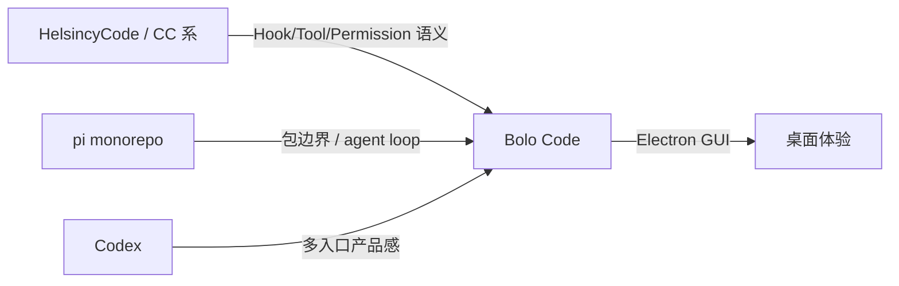
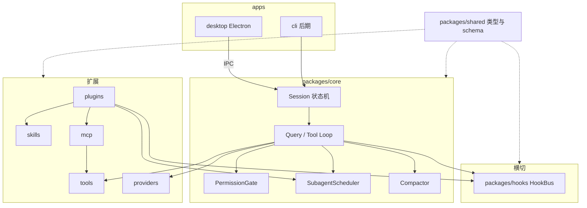
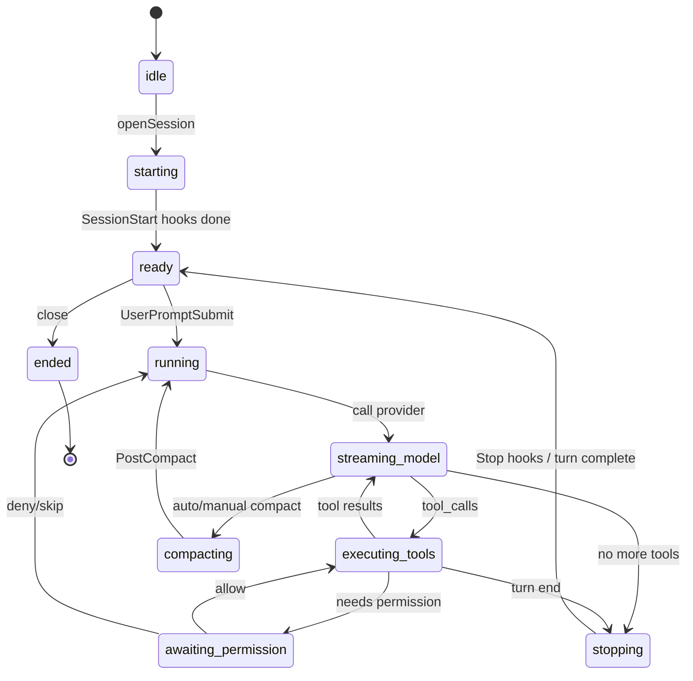
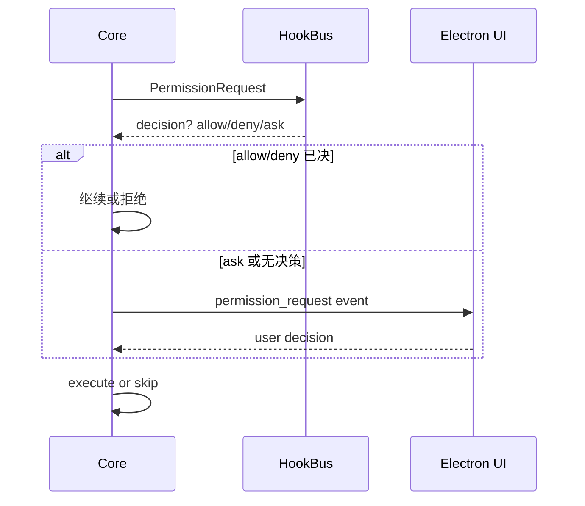

# Bolo Code 深度分析

> 与 `ARCHITECTURE.md` / `HOOKS.md` / `ROADMAP.md` 配套。  
> 本文回答：**为什么这样拆、数据怎么流、风险在哪、如何验收**。  
> 工作记忆（可被 compact 冲掉的会话细节）见仓库根目录 `task_plan.md` / `findings.md` / `progress.md`。

## 1. 问题本质

用户要的不是「又一个 Chat 窗口」，而是：

```
可扩展的本地 Coding Agent Runtime
        +
跨平台一致的图形壳（Electron）
```

扩展面是产品护城河：

| 能力 | 用户价值 |
|------|----------|
| Skill | 可打包的领域工作流（文档+脚本） |
| MCP | 连接外部工具生态 |
| Hook | 企业策略 / 审计 / 自动审批 / 注入 |
| 子代理 | 并行与职责隔离 |
| 插件 | 一键安装上述贡献点 |

没有 Runtime 契约，GUI 只会堆交互；没有 GUI，本地 agent 难用。  
**顺序必须是：契约 → 可测 Core → 扩展 → GUI → 生产化。**

## 2. 参考项目怎么「用」



### 2.1 抽取粒度

| 层级 | 做 | 不做 |
|------|----|------|
| 事件与策略 | 事件名、matcher、exit code | 复制 hook 调度器实现细节 |
| 运行时 | Session / ToolRegistry / Permission 接口 | 复制 50 万行状态与 flag |
| UI | 会话、审批、工具轨迹概念 | Ink 组件树 |
| 工程 | monorepo 边界 | 对方构建系统全盘照搬 |

### 2.2 反模式

1. **先抄 UI 再补 core** → 两套逻辑  
2. **tool 内写权限** → 无法统一 hook / 策略  
3. **插件可绕过 PermissionGate** → 安全模型崩  
4. **把 IDE 的 Cursor hooks 当成产品 hooks** → 事件名与语义冲突  

## 3. 目标架构（模块关系）



### 3.1 依赖方向（强制）

```
shared ← hooks / tools / skills / mcp / plugins / providers / core
core ← apps/desktop（及未来 cli）
```

禁止：

- `tools` → `electron`
- `renderer` → 直接 `child_process`
- `mcp` → `hooks` 循环依赖（hook 只由 core 在固定点调用）

### 3.2 包职责一句话

| 包 | 一句话 |
|----|--------|
| shared | 唯一类型真源 |
| hooks | 纯调度：匹配 + 执行 + 归约结果 |
| tools | 副作用实现，不决策权限 |
| skills | 发现与材料化上下文 |
| mcp | 协议客户端 → Tool 适配 |
| plugins | 贡献点加载与合并 |
| providers | 字节流进、结构化 tool_call 出 |
| core | 编排上述一切的状态机 |
| desktop | 可视化与人机审批 |

## 4. 状态机



**awaiting_permission** 是 GUI 关键点：renderer 弹窗 → main → core 恢复 Promise。

## 5. 单次 Turn 数据流（窄链路）

端到端最小证明路径（Phase 3 验收）：

```
用户输入字符串
  → UserPromptSubmit hooks（可改/可拦）
  → messages[]
  → Provider.stream
  → tool_call { name: Bash, input }
  → PreToolUse
  → PermissionRequest → UI 或 hook decision
  → tools.Bash.execute
  → PostToolUse
  → tool_result 回灌 messages
  → Provider 再答或结束
  → Stop hooks
```

任何一步不能解释清楚，**禁止横向加 MCP/插件复杂度**。

## 6. Hook 系统详细设计

### 6.1 为何 10 个是「最小完备集」

| 生命周期段 | 事件 | 完备性 |
|------------|------|--------|
| 会话 | SessionStart | 环境注入 |
| 输入 | UserPromptSubmit | 策略/脱敏/拦截 |
| 工具前 | PreToolUse | 审计/改参/拦 |
| 权限 | PermissionRequest | 自动化审批 |
| 工具后 | PostToolUse | 审计/纠偏 |
| 压缩 | Pre/PostCompact | 长会话可控 |
| 子代理 | Start/Stop | 多代理可观测 |
| 结束 | Stop | 续跑/收尾策略 |

### 6.2 Matcher 规则矩阵

| 事件 | 匹配字段 | 支持通配 | 忽略 matcher |
|------|----------|----------|--------------|
| PermissionRequest | tool_name | 是（`apply_patch*`） | 否 |
| Pre/PostToolUse | tool_name | 是 | 否 |
| Pre/PostCompact | trigger | 否（枚举） | 否 |
| SessionStart | source | 否（枚举） | 否 |
| SubagentStart/Stop | agent_type | 可选 | 否 |
| UserPromptSubmit | — | — | **是** |
| Stop | — | — | **是** |

### 6.3 执行器 v1

```
input JSON → stdin
command hook → child process
exit 0 / 2 / other → 按事件语义归约
stdout → 尝试 parse JSON（Permission 等）
stderr → 用户或模型（按事件）
```

异步 hook（`async: true`）v1 可不实现，预留字段即可。

### 6.4 PermissionRequest 与 GUI 协作



## 7. 扩展面详细设计

### 7.1 Skills

```
发现路径（优先级从低到高可覆盖元数据，内容合并策略另定）:
  bundled < user < project < plugin(session active)
```

每个 skill：

- `SKILL.md` frontmatter：name, description, triggers?
- body：指令
- 可选 `scripts/`：由 skill 文档指引调用，仍走 tools + permission

### 7.2 MCP

```
mcp.json → spawn stdio client → listTools
  → register ToolSpec name = mcp__{server}__{tool}
  → 执行时转发 callTool
```

PermissionRequest matcher 必须能匹配完整名与前缀策略（文档约定 `mcp__*`）。

### 7.3 插件

```jsonc
// bolo.plugin.json（示意）
{
  "id": "acme.review",
  "version": "0.1.0",
  "contributes": {
    "skills": ["./skills"],
    "hooks": "./hooks.json",
    "mcpServers": "./mcp.json",
    "agents": ["./agents/explore.json"],
    "commands": ["./commands"]
  }
}
```

合并顺序见 ARCHITECTURE §4.3。同名 tool **必须** namespace 或拒绝加载并报错。

### 7.4 子代理

| 字段 | 说明 |
|------|------|
| agent_id | 运行时 UUID |
| agent_type | explore / shell / general / 插件定义 |
| tool_allowlist | 子集 |
| parent_session_id | 回写目标 |
| transcript_path | 可选落盘 |

生命周期 hook 必触发；子代理内 tool 仍走 Pre/Post/Permission。

## 8. Electron GUI 信息架构（Phase 5）

| 视图 | 数据来源 | 交互 |
|------|----------|------|
| 会话列表 | core session store | 新建/恢复 |
| 对话流 | message events | 流式渲染 |
| 工具卡片 | tool start/end events | 展开 IO |
| 权限模态 | permission_request | Allow/Deny/Always |
| 设置 | config files | 模型/MCP/Hooks/Skills |

**渲染进程状态**仅为 UI 镜像；权威状态在 core。

## 9. 风险登记

| ID | 风险 | 等级 | 缓解 |
|----|------|------|------|
| R1 | 范围膨胀抄大仓 | 高 | 窄链路验收门禁 |
| R2 | GUI 旁路执行 | 高 | IPC 白名单 + core 唯一执行面 |
| R3 | Hook 阻塞卡死 UI | 中 | timeout + fail-open 默认 |
| R4 | MCP 工具名冲突 | 中 | 强制前缀 + 加载失败可见 |
| R5 | 子代理权限过宽 | 高 | allowlist + 继承策略默认收紧 |
| R6 | 密钥进 renderer | 高 | main/keychain only |
| R7 | Compact 丢关键上下文 | 中 | PreCompact 注入 + 磁盘规划文件 |

## 10. 里程碑验收（可测试）

### M0 文档与契约

- [x] 10 Hook 事件写入 shared + HOOKS.md  
- [x] 架构与路线图可读  
- [x] 无本机路径泄露  

### M1 Core 窄链路

- [ ] Node 脚本：mock 模型触发 Bash  
- [ ] PreToolUse 可 block（exit 2）  
- [ ] PermissionRequest 可被 hook allow  
- [ ] Stop 可触发  

### M2 扩展

- [ ] 放置 skill 后上下文可见  
- [ ] 配置 MCP 后出现 `mcp__*` 工具  
- [ ] 插件 contributes 合并单测  

### M3 GUI

- [ ] 窗口内完成一轮 mock 会话  
- [ ] 权限弹窗可放行/拒绝  

### M4 生产

- [ ] 真模型  
- [ ] compact manual/auto  
- [ ] 会话 resume  

## 11. 建议实现切片（Phase 3 开工清单）

按文件职责（实现时再改代码）：

1. `packages/shared` — 补全各事件 Input 类型  
2. `packages/hooks` — `runCommandHook` + 结果归约  
3. `packages/core` — `createSession` / `submitPrompt` / 状态转移  
4. `packages/providers` — `MockProvider`  
5. `packages/tools` — Bash/Read/Write 最小实现  
6. `packages/core` 测试或 `scripts/smoke-turn.ts` — 端到端  

**完成标准**：CI 或本地一条命令证明窄链路为绿。

## 12. 文档地图

| 文件 | 角色 |
|------|------|
| docs/ARCHITECTURE.md | 产品架构总览 |
| docs/HOOKS.md | Hook 契约（实现真源） |
| docs/ROADMAP.md | 阶段与完成标准 |
| docs/REFERENCES.md | 参考取舍 |
| docs/DEEP_ANALYSIS.md | 本文：分析与验收 |
| task_plan.md | 会话工作计划 |
| findings.md | 研究记忆 |
| progress.md | 会话日志 |

---

**结论**：Bolo Code 应作为 **「带完整横切扩展面的 headless agent + Electron 壳」** 建设；10 个 Hook 是策略层最小完备集；大仓只借语义。下一步唯一正确动作是 **M1 窄链路变绿**，而不是先做漂亮 UI 或接入全部 MCP。