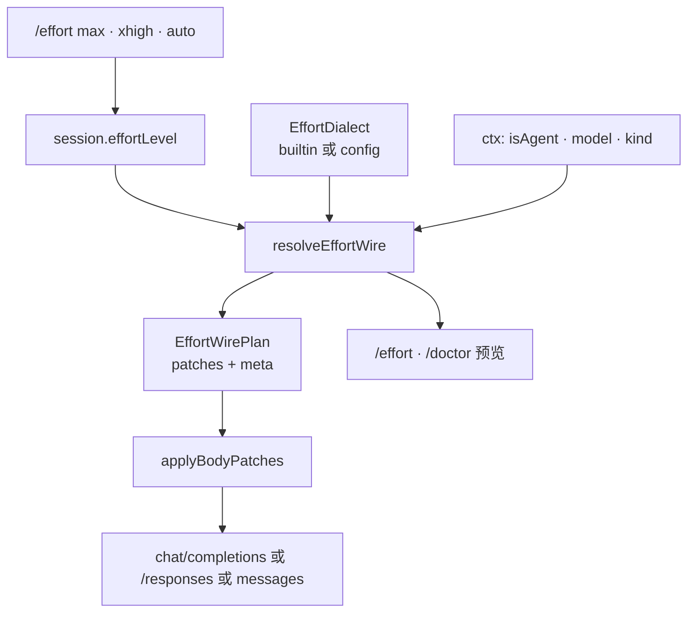

# Effort 轨 · 推理强度方言（规划）

> **状态：** E0–E4 日用已落地（引擎 + deepseek-chat + openai-responses + config）；E5 抛光后置  
> **痛点（已缓解）：** `/effort` 曾只映射 `max_tokens`；现按 **EffortDialect 表** 写入各家 reasoning 字段。  
> **目标：** **通用「强度意图 → 请求体补丁」引擎** + **可插拔方言数据**（内置包 + 用户 config）；新后端以改表为主。  
> **原则：** 无遥测；密钥不进 log；借鉴 HC / OpenAI / DeepSeek **语义**，不抄实现。

相关入口：

| 文档 | 角色 |
|------|------|
| 本文 | **E 轨真源**（方言 schema · 映射 · 阶段） |
| [ROADMAP.md](./ROADMAP.md) §10 | 总路线水位 |
| [PROVIDERS.md](./PROVIDERS.md) | 协议 kind · 多 provider |
| [CONFIG.md](./CONFIG.md) | `providers.*.effort` 配置位 |
| [PROMPT_CACHE.md](./PROMPT_CACHE.md) | 切换 effort 时 cache-break |

---

## 0. 一句话

```text
用户层：一个 effort 意图字符串（/effort · session.effortLevel）
  ↓
引擎层：resolveEffortWire(dialect, level, ctx) → body patch（纯函数）
  ↓
协议层：openai-compatible / responses / anthropic 只 apply patch 再发车
```

- **不要**为每个品牌维护永久 `if` 适配器  
- **要**维护少量 **wire shape 模板** + 任意多份 **dialect 数据**  
- 新模型多半 = 新/改 json 方言，**不必等发版认型号**

---

## 1. 现状（诚实）

### 1.1 Bolo 今天

| 项 | 状态 |
|----|------|
| `/effort low\|medium\|high\|max\|auto` | ✅ 会话字符串 |
| `mapEffort` → `max_tokens` / `max_output_tokens` | ✅ **仅此** |
| DeepSeek `reasoning_effort` 写入 | ❌ |
| OpenAI Responses `reasoning.effort` 写入 | ❌ |
| Anthropic / HC `output_config.effort` | ❌ |
| 读流：`reasoning_content` / thinking_delta | ✅ 展示侧已有 |
| `xhigh` / `ultra` 入 `/effort` | ❌（subagent 别名压成 max 仍走 tokens） |

**结论：** 名字像「推理强度」，实现是「输出长度旋钮」。对 GPT‑5.x / DeepSeek V4 等 **启动不了真·高档推理**。

### 1.2 各家客观差异（对照）

| 来源 | 用户/API 档 | Wire 字段 | 备注 |
|------|-------------|-----------|------|
| **HC** | `low\|medium\|high\|max` + auto | `output_config.effort` + 独立 thinking | `max` 常模型门控；`ultrathink` 是产品触发不是 OpenAI ultra |
| **OpenAI 5.x Responses** | 子集含 `none\|minimal\|low\|medium\|high\|xhigh\|max` | `reasoning.effort`；可选 `reasoning.mode` | 与 `max_output_tokens` 正交；**公开枚举通常无 `ultra` 字面量** |
| **DeepSeek Chat** | 真值 **`high\|max`** | 顶层 `reasoning_effort`；另有 `thinking.type` | 官方：low/medium→high，xhigh→max；普通默认 high；Agent 类可自动 max |
| **其它中转** | 各异 | 多为顶层字段或嵌套 object | **形状有限，档位用表** |

DeepSeek 文档（真源摘要）：  
https://api-docs.deepseek.com/zh-cn/api/create-chat-completion  

- `reasoning_effort`: `high` \| `max`  
- 兼容：`low`/`medium` → `high`；`xhigh` → `max`  
- `thinking.type`: `enabled` \| `disabled`

---

## 2. 设计原则

| # | 原则 | 说明 |
|---|------|------|
| P1 | **两层分离** | 会话只存意图；wire 只由方言表生成 |
| P2 | **形状有限、档位用表** | 代码维护 shape 模板；厂商差异进 dialect |
| P3 | **用户可自扩展** | `config` 可挂内置 id 或内联 dialect，无需改 core |
| P4 | **强度 ≠ max_tokens** | 有 reasoning 字段时主路径写字段；tokens 仅辅调或 fallback |
| P5 | **折叠要诚实** | `low→high` 可在 doctor/`/effort` 显示；禁止静默只改 tokens 冒充 |
| P6 | **热切只换方言** | 与 P 轨一致：保留 `effortLevel`，新 provider 用新表再 resolve |
| P7 | **无遥测** | 不上传档位选择；不写 apiKey |

**明确拒绝的架构：**

```text
❌ if (deepseek) ... else if (openai) ... else if (kimi) ...  // 厂商分支永久膨胀
❌ 全球强制同一六档 API 字面量                                // 与 DS 二值、HC 四档冲突
❌ 只扩 /effort 枚举不写 wire                                  // 假完成
```

---

## 3. 架构

### 3.1 数据流



### 3.2 模块职责

| 模块 | 只做什么 | 禁止 |
|------|----------|------|
| `packages/providers` effort 引擎 | dialect 解析 · resolve · apply patch · builtin 数据 | 会话状态机 · slash UI |
| `packages/core` | 存 `effortLevel`；callModel 传 effort；`/effort` 校验与展示预览 | 写死 DeepSeek 字段名 |
| `packages/config` | `providers[].effort` 合并；挂 dialect id / 内联 | 发 HTTP |
| `packages/cli` | 展示；可选 TTY 选档（后置） | 再算一遍映射 |
| `apps/desktop` | 后置设置项 | 重业务 |

建议路径（实现时）：

```text
packages/providers/src/effort/
  types.ts          # Dialect · WireShape · EffortWirePlan
  resolve.ts        # 纯函数
  apply.ts          # body JSON patch
  builtins/         # deepseek-chat.json · openai-responses.json · …
  detect.ts         # 可选指纹（可关）
  index.ts
# 现有 effort.ts 的 mapEffort → 降为 dialect「max-tokens」的实现细节
```

### 3.3 与 callModel 交叉

```text
queryLoop / deps.callModel
  → completeStream({ effort: session.effortLevel, model, ... })
  → provider 内部：
       dialect = profile.effort ?? detect ?? kindDefault
       plan = resolveEffortWire(dialect, effort, { isAgent: true, model })
       body = applyBodyPatches(baseBody, plan.patches)
       // plan.maxTokensHint 可并入 max_tokens（辅）
```

切换 `/provider` / `/model`：本地 prompt-cache **break**（已有 forced / model_changed 路径可复用）。

---

## 4. 方言 Schema（契约草案）

### 4.1 Wire shape（代码稳定集 · 少）

| `shape` | 含义 | 参数 |
|---------|------|------|
| `body_field` | 请求体顶层字段 | `field: string` |
| `nested_object` | 嵌套对象上设键 | `path: string`（如 `reasoning.effort`） |
| `output_config` | Anthropic 风格 `output_config.effort` | 可选 |
| `none` | 不写强度字段 | — |

一条 dialect 可含 **多条** wire 指令（例如同时设 `reasoning_effort` + `thinking.type`）。

### 4.2 EffortDialect（数据）

```ts
/** 用户意图：超集；不要求每家都实现全部 */
type CanonicalEffort =
  | 'auto'
  | 'none' | 'off'
  | 'minimal' | 'low' | 'medium' | 'high' | 'xhigh' | 'max'
  | 'ultra'          // 建议仅作别名，默认 → max
  | string           // passthrough 模式允许原生串

type EffortWireOp =
  | {
      shape: 'body_field'
      field: string
      /** null = 删除/不设该字段 */
      valueFrom: 'resolved' | 'fixed'
      fixed?: string | boolean | number | null
    }
  | {
      shape: 'nested_object'
      path: string          // dot path: reasoning.effort
      valueFrom: 'resolved' | 'fixed'
      fixed?: string | boolean | number | null
    }
  | {
      shape: 'output_config'
      key?: 'effort'        // 默认 effort
      valueFrom: 'resolved' | 'fixed'
      fixed?: string | number | null
    }
  | { shape: 'none' }

type EffortDialect = {
  id?: string
  /** 该后端「原生」可接受的 wire 值列表（文档/校验） */
  levels: string[]
  /** 非 agent 时 auto 的默认 wire；缺省 = 不写字段 */
  default?: string | null
  /** agent 主循环 auto 时默认 wire（对照 DS：复杂 Agent → max） */
  agentDefault?: string | null
  /**
   * 意图 → wire 值。
   * 缺键策略见 resolve.missing（reject | passthrough | clamp）
   */
  map: Record<string, string | null>
  /** 仅别名归一到 canonical 再查 map，如 ultra→max */
  aliases?: Record<string, string>
  /** 主强度写入 */
  wire: EffortWireOp[]
  /** resolved 为 null / none 时额外 op（如 thinking disabled） */
  onNone?: EffortWireOp[]
  /**
   * 无 map 命中时：
   * - reject：/effort 失败或 call 前失败
   * - passthrough：若值 ∈ levels 则原样写
   * - clamp：最近邻（后置，慎用）
   */
  missing?: 'reject' | 'passthrough' | 'clamp'
  /**
   * 可选：仍调整 max_tokens 的倍率（辅）；主路径有 reasoning 字段时可不设
   */
  tokenScale?: Partial<Record<string, number>>
  notes?: string
}
```

### 4.3 配置挂载

```jsonc
// ~/.bolo/config.json 或 .bolo/config.json
{
  "providers": {
    "sf": {
      "kind": "openai-compatible",
      "baseUrl": "https://api.siliconflow.cn/v1",
      "model": "deepseek-ai/DeepSeek-V4-Flash",
      "apiKeyEnv": "SILICONFLOW_API_KEY",
      "effort": {
        // 方式 1：内置 id
        "dialect": "deepseek-chat"
        // 方式 2：内联（新中转自描述）
        // "dialect": { "levels": ["high","max"], "map": { ... }, "wire": [ ... ] }
      }
    },
    "oai": {
      "kind": "openai-responses",
      "model": "gpt-5.6",
      "effort": { "dialect": "openai-responses" }
    }
  }
}
```

合并：user/project 同 provider id 时 `effort` 浅合并；内联 dialect 后写覆盖。

### 4.4 resolve 算法（固定）

```text
function resolveEffortWire(dialect, level, ctx):
  raw = trim(level) or "auto"
  if raw in aliases: raw = aliases[raw]

  if raw == "auto":
    wireVal = ctx.isAgent && dialect.agentDefault != null
              ? dialect.agentDefault
              : dialect.default   // 可为 null → 不写强度字段
  else if raw in map:
    wireVal = map[raw]
  else if missing == passthrough && raw in levels:
    wireVal = raw
  else if missing == reject:
    fail with clear message
  else:
    fail or clamp（后置）

  patches = []
  if wireVal == null:
    patches += apply ops onNone or skip intensity wire
  else:
    patches += apply dialect.wire with resolved=wireVal

  optional: maxTokens from tokenScale[raw] or legacy mapEffort
  return { patches, resolvedWire: wireVal, display: `${raw} → ${wireVal}` }
```

---

## 5. 内置方言（启动包 · 样例数据）

> 内置 = 方便日用，**不是**封闭世界。用户可覆盖或自建。

### 5.1 `deepseek-chat`

对照官方 Chat Completions：

| 项 | 值 |
|----|-----|
| levels | `high`, `max` |
| default | `high`（或不写，等价服务端默认） |
| agentDefault | `max` |
| map | low/medium/minimal→high；high→high；xhigh/max/ultra→max；none/off→null |
| wire | `body_field: reasoning_effort` |
| onNone | 可选 `nested_object: thinking.type = disabled` |

### 5.2 `openai-responses`

| 项 | 值 |
|----|-----|
| levels | none, minimal, low, medium, high, xhigh, max（按模型子集；不支持的由 missing 处理） |
| default | null（省略 → 模型默认，常 medium） |
| agentDefault | 可配置，建议 null 或 medium |
| map | 基本恒等；ultra→max（或 xhigh，可配置） |
| wire | `nested_object: reasoning.effort` |
| 辅 | 保留合理 `max_output_tokens` 缓冲（防 reasoning 吃光窗口） |

`reasoning.mode: pro`：**后置**（独立字段或 `/effort mode pro`），不塞进 strength map。

### 5.3 `anthropic-output`（对齐 HC 语义，能做多少做多少）

| 项 | 值 |
|----|-----|
| levels | low, medium, high, max |
| map | xhigh/ultra→max；minimal→low；none→null |
| wire | `output_config.effort`（若当前 anthropic 客户端已支持该字段；否则分阶段） |
| 另 | 现有 `anthropicThinking` / budget 与 effort **协同策略在实现切片写清**，避免双拧 |

### 5.4 `max-tokens`（兼容旧 Bolo）

| 项 | 值 |
|----|-----|
| wire | `none`（不写 reasoning 字段） |
| tokenScale | 沿用现 `mapEffort` 倍率 |
| notes | doctor 标明「仅 max_tokens，非 API 推理强度」 |

### 5.5 `off`

完全不写、不调（或仅用户显式 maxTokens）。

### 5.6 `passthrough-body`（极客 / 新模型）

- `missing: passthrough`
- `body_field` 字段名可配置（默认 `reasoning_effort`）
- levels 用户自填；`/effort raw值` 原样下发（若 ∈ levels 或允许任意）

---

## 6. 产品行为

### 6.1 `/effort`

| 输入 | 行为 |
|------|------|
| 无参 | 显示：canonical · 当前 dialect id · **将发成 wire 预览** · 本方言 levels |
| `auto` | 清空会话覆盖（或显式存 auto）；下一次用 default/agentDefault |
| 超集名 | 接受；resolve 失败则 **明确错误**，不改 session |
| `ultra` | 别名 → 通常 max（方言 aliases） |

**不要求**用户记住 DeepSeek 只有 high/max；统一说 low/high/max，由表折叠。

### 6.2 Agent 默认（对照 DeepSeek）

| 场景 | 建议 |
|------|------|
| 主 queryLoop（Bolo agent） | `ctx.isAgent=true` → 用 `agentDefault`（deepseek-chat → max） |
| 普通 completeText / 分类器 | `isAgent=false` → default / 省略 |
| subagent | 继承父 effort 字符串；子可覆盖；resolve 用**子会话当前** dialect |

### 6.3 两种使用模式

| 模式 | 说明 |
|------|------|
| **A 统一意图（默认）** | 用户总用 low…max/auto；方言折叠 |
| **B 原生透传** | passthrough 方言或 `/effort` 写入 ∈ levels 的原生串 |

### 6.4 探测（可选 · 默认可关或保守）

指纹仅 **建议** dialect，不强制：

- model/baseUrl 含 `deepseek` → `deepseek-chat`
- kind `openai-responses` → `openai-responses`
- kind `anthropic` → `anthropic-output`
- 否则 → `max-tokens` 或 `off`（诚实降级）

用户 `effort.dialect` **总是覆盖**探测。

---

## 7. 阶段切片（E0–E5）

| 阶段 | 交付 | 灵活点 | 状态 |
|------|------|--------|------|
| **E0** | 本文 + ROADMAP §10 + PROVIDERS/CONFIG 入口 | 契约 | 📋 本文 |
| **E1** | `EffortDialect` 类型 · `resolveEffortWire` · `applyBodyPatches` · 单测纯函数 | **引擎一次** | 📋 |
| **E2** | builtin：`deepseek-chat` + `max-tokens`；compatible 发车 apply；`/effort` 超集 + 预览 | DS/硅基日用 | 📋 |
| **E3** | builtin：`openai-responses`；Responses 写 `reasoning.effort` | 5.x 真强度 | 📋 |
| **E4** | `providers.*.effort` 配置 · 内联方言 · 可选 detect | **用户自扩展** | 📋 |
| **E5** | anthropic-output 协同 · doctor 深化 · cache-break 文案 · 回归 | 对齐 HC | 📋 |
| 后置 | `reasoning.mode=pro` · 数字档 shape · TTY 选档 · Desktop | — | 🚫 非默认 |

**顺序硬约束：**

```text
E0 文档 → E1 引擎 → E2 数据+compatible 接线
       → E3 responses → E4 配置开放 → E5 抛光
```

**禁止：** 未完成 E1 就堆厂商 if；未完成 wire 就宣称「支持 ultra」。

---

## 8. 验收

### 日用

1. DeepSeek 类：`/effort max` → 请求 JSON **含** `"reasoning_effort":"max"`  
2. `/effort low` → DS 上 `"high"`；UI 可显示 `low → high`  
3. OpenAI Responses：`/effort xhigh` → `reasoning.effort = "xhigh"`  
4. 自定义 dialect：只改 config，**不改代码**，新 `body_field` 能下发  
5. 无方言/off：行为可预测；doctor 不谎称「已开 API 推理强度」  
6. `/provider` 热切后，同一 `effortLevel` 按新方言重新 resolve  

### 工程

| 测试 | 覆盖 |
|------|------|
| `test-effort-resolve.ts`（新） | map/alias/auto/agentDefault/missing |
| build body fixture | deepseek · responses 快照（无真 key） |
| 回归 | test-provider-unit · test-slash · smoke-turn |

### 不做（E 轨内）

- 遥测 / 官方市场拉「模型能力表」  
- 为每个品牌永久 TS 适配器  
- 把 apiKey 或完整 body 打进 transcript  
- 未验证 shape 的「自动扫描全网参数名」

---

## 9. 提交建议

1. `docs: plan effort dialect E-track`（E0 · 本文）  
2. `feat: effort resolve engine and body patches`（E1）  
3. `feat: deepseek-chat dialect and reasoning_effort wire`（E2）  
4. `feat: openai-responses reasoning.effort dialect`（E3）  
5. `feat: config providers.effort dialect hookup`（E4）  
6. `test+docs: effort waterline`（E5 部分）

只 stage 本轨；**勿提交 `.bolo-tmp/`**；**勿提交真实 apiKey**。

---

## 10. 风险与边界

| 风险 | 缓解 |
|------|------|
| 中转声称兼容但忽略字段 | doctor 只能保证「已发送」；效果以上游为准 |
| 模型不支持某档返回 400 | missing/levels 收紧；错误回显不重试烧钱（可后置） |
| 方言写错 path | 单测 fixture；内置包 review |
| 与旧 max_tokens 行为变化 | 默认未配 dialect 时保持 `max-tokens` 兼容，避免 silent break |
| ultra 用户预期 | 文档写清：别名 → max，非独立 API 值 |

---

## 11. 文档维护

| 变更 | 更新 |
|------|------|
| 新增 builtin 方言 | 本文 §5 + builtins 目录 |
| 新增 wire shape | 本文 §4.1 + shapes 实现 |
| 配置字段 | CONFIG.md · PROVIDERS.md |
| 水位 | ROADMAP §0 / §10 |

**实现开始后：** 将本文状态从 📋 改为分阶段 ✅；`mapEffort` 仅作为 `max-tokens` 方言内部细节保留。