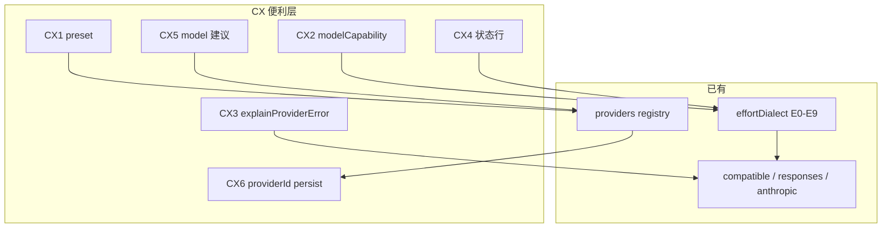

# Provider UX 方案（CX 轨 · 最好用 / 最稳）

> **状态：** ✅ **CX0–CX8 已实现**（preset · resume · errors · caps · tip · model 建议 · Desktop · **ultrathink 默认 off**）  
> **目标：** 多协议日用 **便利 ~95%+**（稳健优先）；**不是**各家 API 全集 100%  
> **前置：** [PROVIDERS.md](./PROVIDERS.md)（协议）· [EFFORT.md](./EFFORT.md) / [EFFORT_OPTIMIZATION.md](./EFFORT_OPTIMIZATION.md)（E0–E9）· [ROADMAP.md](./ROADMAP.md) §9–§11  
> **对照（语义，不抄实现/遥测）：** HelsincyCode · Codex · OpenCode · Pi  
> **原则：** 表驱动 · 无遥测 · 密钥不进 log/仓库 · **不绑 AI SDK** · 不把 Responses 伪装成 Completions  
> **测试：** `scripts/test-provider-ux.ts` · `scripts/test-ultrathink.ts` · `apps/desktop/scripts/smoke-ipc.mjs`

---

## 0. 一句话

```text
协议层「能跑」已接近日用满分（compatible / responses / anthropic + DeepSeek 方言）
CX 轨补的是：接通快 · 少 400 · 坏了会说话 · 重启还在 · 状态一眼懂
```

| 要 | 不要 |
|----|------|
| preset 三分钟接通 | 强迫用户先懂 kind 细节 |
| 轻量 model capability ∩ dialect | Pi 全网 catalog / OpenCode AI SDK 巨表 |
| resume 粘 `providerId` + clamp | 整份 profile 快照（密钥/陈旧风险） |
| ultrathink **默认 off**、可后置 tip/turn | 默认改全局 effort / 遥测 |
| 错误可行动 | raw 上游堆栈当唯一 UI |

---

## 1. 决策锁定（稳健 × 方便）

选型标准：**健壮 > 稳定可测 > 日用方便 > 功能炫**。

| # | 议题 | **锁定** | 为何更稳/更方便 | 明确不做 |
|---|------|----------|-----------------|----------|
| **1** | 入门 | **CX1 Preset**（`/provider add`） | 5–8 个日用模板覆盖 90%；少配置错误 | 官方市场 / OAuth 产品桥 |
| **2** | Model catalog | **内置轻表 + 用户/profile 覆盖** | 可单测、可覆盖、维护税低；与 E6 choosable 求交 | 全量生成流水线；主路径依赖 `/v1/models` 猜 effort |
| **3** | ultrathink | **默认 off；规格预留；实现后置** | 无惊喜、无账单惊吓；需要时再 `tip`→`turn` | 默认 on；persist 改 settings；遥测 |
| **4** | resume 后端 | **R2：persist `providerId` + 已有 model/effort + 统一 clamp** | 热切故事完整；缺 key 降级可预期 | 整 profile 快照进 transcript |

### 1.1 细节默认（实现直接照此）

| 细节 | 锁定 |
|------|------|
| capability `match` | **第一版子串**（小写包含）；够稳；glob 后置 |
| effort clamp 降到 | **`auto`（清 session 覆盖）** + 一行 warning；不自动抬到 DS `agentDefault=max`（避免 resume 变贵） |
| ultrathink 抬档 | 若实现 **turn**：目标 **high**（HC 语义）；仍须 `assertEffortChoosable` |
| resume 失败提示 | **CLI/doctor 可见** + 可选一条 `system_note`（可查、不进模型链） |
| 规则优先级 | profile caps → 全局 caps → 内置表 → 仅 dialect |
| E7 max 门控 | 与 capability 规则 **收敛为同一 resolve**（避免双逻辑分叉） |

---

## 2. 业界对照（压缩）

| 项目 | 便利点 | Bolo 取 | 不取 |
|------|--------|---------|------|
| **HC** | 档少而清；max 门控；状态可见；ultrathink 糖 | 门控 · 状态 · 糖规格（默认 off） | GrowthBook / 遥测 / 单栈 |
| **Codex** | catalog 只露支持档；model↔effort 联动 | **轻量** supported 求交 | 全量 Rust catalog |
| **OpenCode** | 多厂商 · variant→options | 意图→patch（已有 dialect） | AI SDK / ProviderTransform 迷宫 |
| **Pi** | `thinkingLevelMap` + compat | map/挖洞思想 → caps ∩ dialect | 全网 models 发布流水线 |
| **Bolo 今** | 3 协议 · E0–E9 · P0–P4.1 热切 | **CX = 便利层** | 重写 wire |

```text
Bolo CX = HC 产品清晰度
        + Codex「按能力约束 UI」（缩小）
        + Pi「map 挖洞」可配置
        + OpenCode「意图→碎片」思想（已有引擎）
        − SDK 绑定 − 全量 catalog − 默认糖
```

---

## 3. 现状水位（诚实）

| 层 | 水位 | 说明 |
|----|------|------|
| 协议日用（工具环 + 流 + usage） | **~88–93%** | compatible / responses HTTP SSE / anthropic |
| Effort 真·wire + choosable | **~92–95%** | E0–E9 |
| 多实例热切 | **~92–96%** | P0–P4.1；**resume `providerId` 未落盘** |
| **接通 / 少踩坑 / 重启粘性** | **~65–75%** | CX 要拉到 **~95%+** |

**已知缺口 → CX 映射**

| ID | 缺口 | 切片 |
|----|------|------|
| G-in | 要手写 kind + dialect | **CX1** |
| G-400 | 同 dialect 下按模型裁档不足 | **CX2** |
| G-err | 上游错误不教人 | **CX3** |
| G-ui | 状态/热切 tip 还可更醒目 | **CX4** |
| G-model | `/model` 无建议列表 | **CX5** |
| G-resume | `providerId` 不进 persist | **CX6** |
| G-desk | Desktop 多 provider | **CX7**（P5） |
| G-sugar | ultrathink | **CX8** ✅ |

---

## 4. 目标架构

```text
┌─────────────────────────────────────────────┐
│  UX：preset · picker · doctor · 错误解释     │  packages/cli · core/slash · desktop
├─────────────────────────────────────────────┤
│  Capability：ModelCap ∩ EffortCapabilityView │  packages/providers
├─────────────────────────────────────────────┤
│  已有：providers 表 · EffortDialect · 三协议   │  config · providers · sessionProvider
└─────────────────────────────────────────────┘
```



**职责**

| 模块 | 只做什么 | 不做什么 |
|------|----------|----------|
| `packages/config` | preset 展开 · caps 配置位 · 校验 | HTTP |
| `packages/providers` | `modelCapability` · `explainProviderError` · 与 dialect 求交 | 会话落盘 |
| `packages/core` | slash · switch · resume 粘性 · clamp | 厂商 if 爆炸 |
| `cli` / Desktop | picker · 展示 | 自写 wire map |

---

## 5. 分切片设计

### CX0 — 文档水位

- 本文为真源；ROADMAP §11；PROVIDERS / REFERENCES 挂链  
- 修正过期「E6+ 📋」（代码侧 E6–E9 已 ✅）

### CX1 — Provider Preset（最高 ROI · **先做**）

**用户：** `/provider add [preset|list]`；无参 TTY 箭头选。

**内置 preset 表（数据）：**

| id | kind | baseUrl 默认 | effort dialect | apiKeyEnv 建议 |
|----|------|--------------|----------------|----------------|
| `openai` | openai-compatible | `https://api.openai.com/v1` | detect / max-tokens | `OPENAI_API_KEY` |
| `openai-responses` | openai-responses | 同上 | `openai-responses` | `OPENAI_API_KEY` |
| `anthropic` | anthropic | `https://api.anthropic.com` | `anthropic-output` | `ANTHROPIC_API_KEY` |
| `deepseek` | openai-compatible | `https://api.deepseek.com` | `deepseek-chat` | `DEEPSEEK_API_KEY` |
| `siliconflow` | openai-compatible | `https://api.siliconflow.cn/v1` | `deepseek-chat` | `SILICONFLOW_API_KEY` |
| `openrouter` | openai-compatible | `https://openrouter.ai/api/v1` | detect | `OPENROUTER_API_KEY` |
| `groq` | openai-compatible | `https://api.groq.com/openai/v1` | detect | `GROQ_API_KEY` |
| `together` | openai-compatible | `https://api.together.xyz/v1` | detect | `TOGETHER_API_KEY` |
| `mistral` | openai-compatible | `https://api.mistral.ai/v1` | detect | `MISTRAL_API_KEY` |
| `xai` | openai-compatible | `https://api.x.ai/v1` | detect | `XAI_API_KEY` |
| `nvidia` | openai-compatible | `https://integrate.api.nvidia.com/v1` | detect | `NVIDIA_API_KEY` |
| `fireworks` | openai-compatible | `https://api.fireworks.ai/inference/v1` | detect | `FIREWORKS_API_KEY` |
| `cerebras` | openai-compatible | `https://api.cerebras.ai/v1` | detect | `CEREBRAS_API_KEY` |
| `huggingface` | openai-compatible | `https://router.huggingface.co/v1` | detect | `HF_TOKEN` |
| `vercel-ai-gateway` | openai-compatible | `https://ai-gateway.vercel.sh/v1` | detect | `VERCEL_AI_GATEWAY_TOKEN` |
| `cloudflare-ai-gateway` | openai-compatible | `https://gateway.ai.cloudflare.com/v1` | detect | `CLOUDFLARE_AI_GATEWAY_TOKEN` |

> P0A（方案 `PROVIDER_EXPANSION_PLAN.md`）：国际兼容 preset 扩容至 16 家（2026-07）；P0B 国内组后续。

行为：

1. 写入 `config.providers.<id>`（id 默认同 preset，可改）  
2. **不写** apiKey 明文；只写 `apiKeyEnv`  
3. 有 key 时可提示 `/provider use <id>`；缺 key **拒绝 use**，保留旧后端  
4. 已存在同 id → 询问覆盖或改名（实现可先「拒绝 + 提示」）

### CX2 — Model Capability 轻表

```ts
type ModelCapRule = {
  match: string              // 小写子串
  effortAllow?: string[]     // 与 dialect choosable 求交
  effortDeny?: string[]
  maxAllowed?: boolean       // 对齐/收敛 anthropic max
  notes?: string
}

// 最终 choosable =
//   listEffortChoosable(dialect, ctx)
//   ∩ applyModelCaps(model, rules)
```

**优先级：** `providers.*.modelCapabilities` → 全局 `modelCapabilities` → `BUILTIN_MODEL_CAPS` → 无 match 仅 dialect。

**内置起步（少而准，实现可微调）：**

| match | 行为 |
|-------|------|
| `opus-4-6` / `opus-4.6` / `opus-4-7`… | max 允许 |
| `sonnet` / `haiku` | max 拒绝（双保险） |
| `gpt-4o` / `gpt-4-turbo` / `gpt-3.5` | deny `xhigh`（若出现） |
| `deepseek` | 空规则（交给 dialect） |

**配置例：**

```jsonc
{
  "modelCapabilities": [
    { "match": "my-proxy-r1", "effortAllow": ["auto", "high", "max"] }
  ],
  "providers": {
    "work": {
      "kind": "openai-compatible",
      "modelCapabilities": [
        { "match": "special", "effortDeny": ["max"] }
      ]
    }
  }
}
```

接入：`listEffortChoosable` / `assertEffortChoosable` / picker / doctor **同一函数**。

### CX3 — 错误可行动

```ts
explainProviderError(err, ctx: {
  providerId?, kind?, model?, effortLevel?, dialect?
}): string
```

| 场景 | 文案要素 |
|------|----------|
| 缺 key | env 名 + `/provider use` 其它 |
| effort / 400 像档位 | 当前 choosable + `/effort` + 可选 LOOSE |
| kind 疑错 | 提示 compatible vs responses vs anthropic |
| max 门控 | model / `BOLO_EFFORT_ALLOW_MAX` / 换 opus |

挂：`completeStream` error 路径 · 相关 slash。**不**把密钥打进文案。

### CX4 — 状态一眼懂

| 位置 | 内容 |
|------|------|
| 状态行 | `providerId` · kind · model · `e=…` · think on/off |
| 热切成功 | 一行：dialect + choosable 摘要 |
| `/model` 展示 | 附 effort wire 预览一行 |
| `/doctor` | 已有 effort detail；补 `providerId` 持久相关提示（CX6 后） |

### CX5 — 模型建议列表

| 级 | 行为 |
|----|------|
| 最小 | preset / profile 自带 `models?: string[]`（3–5 个） |
| `/model` bare | TTY 可箭头选建议列表（无则文本） |
| 后置 | 可选拉 `/v1/models`（超时失败静默）— **不**当 capability 来源 |

### CX6 — resume `providerId` + 统一 clamp（**稳健关键**）

**落盘（meta / snapshot，与 effort 同管道）：**

```ts
{
  providerId?: string   // 新增
  model?: string        // 已有
  effortLevel?: string  // 已有
}
```

**只存 id，不存 apiKey / 不整份 profile。**

**resume：**

```text
1. 读 providerId；空 → defaultProvider（现行为）
2. registry 有 id 且 key 可用 → 建连该 profile
3. 否则 → defaultProvider + 警告
   （CLI 输出；可选 system_note：resume provider X unavailable）
4. 恢复 model（合理范围内）
5. clampEffortForSession：
   不可选 → effortLevel = undefined（auto）+ warning
```

**热切 `/provider use`：** 保留 effort **意图** → 同一 `clampEffortForSession`（禁止静默脏档）。

### CX7 — Desktop

- 设置：preset 列表 · env 名展示 · 切换消费 **同一** capability API  
- 不在 renderer 维护第二份 map  
- 可与 P5 合并交付

### CX8 — ultrathink（**已落地 · 默认 off**）

| 模式 | 行为 | 默认 |
|------|------|------|
| `off` | 忽略关键词 | **默认** |
| `tip` | 检测到 `ultrathink` → warning 提示 `/effort high`，**不**改状态 | 可选 |
| `turn` | **仅本轮** `effectiveEffort` → **high**；**不**写 `session.effortLevel` | 可选 |

**开启方式（优先级）：** `/ultrathink tip|turn`（会话） > `BOLO_ULTRATHINK=tip|turn` > `config.ultrathink` > off

硬约束（turn）：

1. 单 turn 作用域（`submitPrompt` → `queryLoop.effortLevel`）  
2. 必须通过 `assertEffortChoosable` ∩ caps；目标 **high**（HC 语义，非 API `ultra`）  
3. UI 可见 `ultrathink → high (this turn)`（`warning` 事件）  
4. **无遥测**  
5. 已 ≥ high（含 xhigh/max/ultra）则不压低  
6. 默认 off：即使用户文本含 `ultrathink` 也不抬档  

实现：`packages/core/src/ultrathink.ts` · `/ultrathink` · `scripts/test-ultrathink.ts`

---

## 6. 实施顺序

```text
CX0  文档（本文 + ROADMAP 挂链）          ← 本提交
CX1  preset /provider add                 ← 实现第一刀
CX6  resume providerId + clamp            ← 粘性（稳）
CX3  explainProviderError                 ← 少踩坑
CX2  modelCapability 轻表                 ← 少 400
CX4  状态行 / 热切 tip
CX5  /model 建议列表
CX7  Desktop
CX8  ultrathink（✅ 默认 off · tip/turn）
```

**并行注意：** CX6 可与 CX1 紧随；CX2 依赖 E6 API 扩展点，不阻塞 preset。

---

## 7. 测试与提交

| 测试 | 覆盖 |
|------|------|
| `test-provider-preset`（新） | preset 展开 shape · 不写 key |
| `test-model-capability`（新或并入 effort-dialect） | 求交 · 优先级 · sonnet max |
| `test-provider-error`（新或 unit） | 缺 key / effort 文案稳定子串 |
| `test-session-persist` / resume | providerId roundtrip · 缺 key 降级 |
| 回归 | `test-multi-provider` · `test-effort-dialect` · `test-slash` · `test-prompt-cache` |

提交示例：

1. `docs: provider UX CX-track design`  
2. `feat: provider presets CX1`  
3. `feat: resume providerId and effort clamp CX6`  
4. `feat: explainProviderError CX3`  
5. `feat: model capability light table CX2`  
…

只 stage 本轨；**勿提交** `.bolo-tmp/`、真实 key。

---

## 8. 验收（便利 95%+）

| # | 标准 |
|---|------|
| 1 | 有 key 时，preset ≤3 分钟接通 DS/OAI/Claude 之一 |
| 2 | 当前 model 不支持的 effort **不在** picker/严格校验通过集 |
| 3 | 常见失败有 **可执行** 下一步（非仅 raw body） |
| 4 | resume 后 providerId 恢复；缺 key **降级+警告**，不炸进程 |
| 5 | 热切后 effort 非法 → clamp 到 auto + 可见 tip |
| 6 | ultrathink 默认不影响任何会话 |
| 7 | 单测绿；无遥测；无密钥入库 |

---

## 9. 后置（不进 CX 主包）

- Responses WebSocket 全家桶  
- 多模态 / computer use  
- OpenCode 级全厂商 transform  
- 自动 multi-provider failover  
- 官方模型市场  
- adaptive thinking ↔ effort 深联动  
- 全量 model catalog 生成 / 发布  
- ultrathink 默认 on 或彩虹依赖

---

## 10. 文档入口

| 文档 | 角色 |
|------|------|
| **本文** | **CX 轨真源**（决策 + 切片） |
| [PROVIDERS.md](./PROVIDERS.md) | 协议 · 多实例 · env |
| [EFFORT.md](./EFFORT.md) / [EFFORT_OPTIMIZATION.md](./EFFORT_OPTIMIZATION.md) | wire · E6–E9 |
| [SESSIONS.md](./SESSIONS.md) | meta / resume 字段（CX6 实现时扩写） |
| [CONFIG.md](./CONFIG.md) | preset / caps 配置位（实现时扩写） |
| [REFERENCES.md](./REFERENCES.md) | 四家对照 |
| [ROADMAP.md](./ROADMAP.md) §11 | 总水位 |

---

## 11. 综合决策（再压缩）

> **Preset 接通 + 轻量 caps 少 400 + 错误会说话 + resume 粘 providerId + clamp + ultrathink 默认关可选 tip/turn。**  
> 多后端表驱动便利，不堆第四套 SDK、不堆全宇宙模型表。