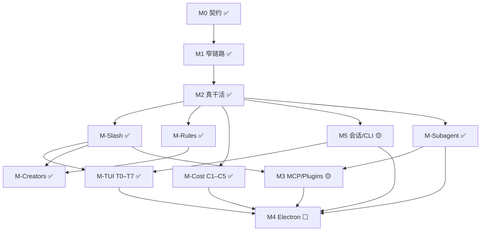

# Bolo Code 整体路线图（详细版）

> 更新：与 **已交付代码** 对齐（含 path-scoped rules 刷新、prompt cache C1–C5 API 标记、openai-responses HTTP SSE）。  
> **勾选与「下一刀」以 `docs/TODO.md` 为准**；本文件回答：**做到哪 / 缺什么 / 验收 / 里程碑**。  
> 原则：借鉴 HelsincyCode / pi / Codex **语义**再实现；**无遥测**；文档无本机绝对路径。

---

## 0. 一句话进度

| 层 | 粗估 | 说明 |
|----|------|------|
| **Headless 核心**（loop / tools / provider / compact / prompt） | **~85–90%** | M0–M2 齐；effort、apply_patch 最小、权限 always-allow 已接 |
| **会话与 CLI** | **~80–85%** | JSON 快照 + JSONL 双写；`--resume` 无 id 列表；`--continue`；无参 `bolo` REPL |
| **扩展面（MCP / Plugins / Skills）** | **~65–70%** | Skills catalog + bundled creators；MCP stdio ✅；plugins 本地最小 ✅ |
| **Subagent** | **~75–80%** | S0–S7 真 loop + Agent + `.bolo/agents`；async/fork/侧链最小；worktree ⬜ |
| **项目规则 Rules** | **~90%** | 装载 + `paths` + submitPrompt 刷新 + `/rules`；enable/disable 持久化可加深 |
| **内置元技能 Creators** | **~85%** | skill-creator / plugin-creator bundled + slash 回落 |
| **成本与缓存** | **~70–75%** | C1–C5 ✅；TTL / break detection / cached MC 后置 |
| **斜杠命令** | **~85%** | 总线 + 日用命令 + SL-polish（分组 help / 建议 / context）；工程类 slash 部分后置 |
| **CLI TUI** | **~60–65%** | T0–T7 最小可用；完整 Ink（T8）⬜ |
| **Electron GUI** | **~5%** | 占位 |
| **产品整体（可日用 headless agent）** | **~65–70%** | 脚本/CLI 可日用；非成熟 GUI agent |

**当前主线（执行序见 `TODO.md`）：**

1. ~~斜杠总线~~ ✅ · ~~Rules~~ ✅ · ~~Creators~~ ✅ · ~~C1–C5~~ ✅  
2. ~~resume 列表 / TUI 最小 / JSONL 双写 / Subagent / MCP / plugins / Responses HTTP~~ ✅  
3. **下一刀候选：** JSONL 细化 · MCP/plugins 深度（**非 Electron**）；slash 体验打磨 ✅  
4. **后置：** OR6 WS · cache TTL/break · T8 Ink · Electron  

---

## 1. 产品目标与硬优先级

| 目标 | 说明 |
|------|------|
| 跨平台 GUI | Electron（一致性优先）；**先 CLI 可日用** |
| Headless Core | CLI / GUI / 自动化同一套 |
| **CLI 体验** | `bolo` 欢迎 + 会话 REPL；品牌 **BOLO** + 原创吉祥物 |
| 扩展面 | Skill · MCP · Hook · **Subagent** · 插件 |
| **项目规则** | `.bolo/rules` 注入；`/rules`；path-scoped |
| **可控成本** | 裁剪 + **prompt cache 标记** + **effort** |
| **可操作会话** | `/` 命令总线 |
| 工程纪律 | 对照参考再写；无遥测 |

```
契约 → Agent loop + Hook + Permission
  → Provider + Tools + System + Compact
  → 会话持久化 + CLI/TUI 最小
  → 斜杠 + Rules + Creators + Cache 标记
  → Skills / MCP / Plugins / Subagent
  → JSONL 深化 · 扩展深度
  → Electron · 完整 Ink · 生产化打磨
```

---

## 2. 能力矩阵（全景）

> 状态：✅ 可用 · 🟡 半成品 · ⬜ 缺失 · 🚫 明确不做

### 2.1 运行时核心

| 能力 | 状态 | 备注 |
|------|------|------|
| queryLoop / Hooks / 四档权限 | ✅ | always-allow 规则表 ✅ 最小 |
| buildTool + 分区并发 + 常用工具 | ✅ | 真 apply_patch ✅ 最小 |
| Provider：OpenAI 兼容 / Anthropic / **openai-responses** / mock | ✅ | Responses：**HTTP SSE** ✅；WS ⬜ |
| System prompt + BOLO.md + Rules | ✅ | |
| Skill catalog + Skill 工具 + slash 调 skill | ✅ | 远程 skill ⬜ |

### 2.2 上下文 · 成本 · Effort

| 能力 | 状态 | 对资源的影响 |
|------|------|----------------|
| Full / auto / micro compact · PTL | ✅/🟡 | auto 默认策略可再调 |
| Skill catalog-only | ✅ | 降输入 |
| **Effort** low/medium/high/max/auto | ✅ | session + `/effort` → max_tokens |
| Prompt Cache 布局 + **API 标记** | ✅ | C1–C5：`cache_control` / `prompt_cache_key` |
| 大 tool_result 预算 | ✅ | 截断 + 可选 spill |
| `/context` `/cost` 本地可见 | ✅ | 无遥测 |

### 2.3 项目规则 Rules

| 能力 | 状态 | 说明 |
|------|------|------|
| `.bolo/rules/**/*.md` + 可选 `~/.bolo/rules` | ✅ | 见 `docs/RULES.md` |
| 装载进 system（与 BOLO.md 分层） | ✅ | |
| frontmatter：`paths` / `alwaysApply` / `disabled` | ✅ | |
| **submitPrompt 刷新 path-scoped rules** | ✅ | 仅换 volatile `# Project rules` |
| `/rules` list · show | ✅ | enable/disable 持久化可加深 |
| 与 prompt cache 协同 | 🟡 | 变更会 break；稳定排序 + API 标记已接 |

### 2.4 内置元技能 / Creator

| 能力 | 状态 | 说明 |
|------|------|------|
| **skill-creator** / **plugin-creator** | ✅ | `packages/bundled-skills/` |
| slash 回落 `/skill-creator` 等 | ✅ | |
| rule-creator（可选） | ⬜ | 后置 |
| 远程市场 | 🚫/⬜ | 不强制 |

### 2.5 会话与 CLI / TUI

| 能力 | 状态 |
|------|------|
| JSON 快照 + `bolo --resume <id\|path>` | ✅ |
| **`bolo --resume` 无 id → 项目列表选择** | ✅ |
| `listProjectSessions`（json + jsonl 去重） | ✅ |
| `bolo --continue` | ✅ |
| JSONL 双写 + 最小 resume（messages 优先 jsonl；R1 boundary） | ✅ 最小 + J-D 部分 |
| **无参 `bolo` TTY 新会话 + banner** | ✅ |
| 状态行 / 流式工具行 / 权限 y/n / slash | ✅ |
| 完整 Ink 级 TUI | ⬜ T8 |
| SQLite | 🚫 现阶段 |

### 2.6 斜杠命令 `/xxx`

| 簇 | 示例 | 状态 |
|----|------|------|
| 总线 | 解析 `/`、help、skill 回落 | ✅ |
| 会话 | `/clear` `/compact` `/context` `/cost` | ✅ |
| 模型与推理 | `/model` **`/effort`** `/plan` `/permissions` `/allow` | ✅ |
| 扩展 | `/skills` `/mcp` `/plugins` `/hooks` **`/rules`** `/agents` `/bg` | ✅ |
| 诊断脚手架 | `/doctor` `/status` `/init` | ✅ |
| 体验打磨 | `/help` 分组 · 未知建议 · `/context` 加深 · 别名隐藏 | ✅ SL-polish |
| 元技能 | `/skill-creator` `/plugin-creator`（skill 回落） | ✅ |
| 工程 | `/diff` `/commit` `/review`… | ⬜ 后置 |
| 产品周边 | login/theme/vim/remote… | 🚫 或后置 |

### 2.7 Subagent

| 能力 | 状态 | 说明 |
|------|------|------|
| Hook SubagentStart/Stop | ✅ | |
| `runSubagent` + Agent 工具 | ✅ | 废 stub |
| 内置 explore / general（+ fork） | ✅ | 禁嵌套 Agent |
| `.bolo/agents` 目录定义 | ✅ | |
| 同步摘要回写父 tool_result | ✅ | |
| 异步 / 后台 | ✅ 最小 | `run_in_background` + `/bg` |
| Fork 继承父 messages | ✅ 最小 | 无 worktree / 无完整 cache 共享 |
| 侧链 transcript | ✅ 最小 | `agent-*.jsonl` |
| `/agents` | ✅ | |
| Worktree / swarm | ⬜ | P3 |
| 遥测 / GrowthBook | 🚫 | |

### 2.8 扩展面 · GUI

| 能力 | 状态 |
|------|------|
| MCP stdio | ✅ |
| MCP SSE/HTTP · resources | ⬜ |
| Plugins 本地加载 | ✅ 最小 |
| Subagent 真 loop | ✅ |
| Electron | ⬜ |

---

## 3. 里程碑详述

### M0–M2 ✅

契约 → 窄链路 → 真 Provider / 工具 / system+BOLO / compact（含 micro、PTL）。

### M2.9 / M-Cost — 缓存与 Token 🟡

| 切片 | 状态 |
|------|------|
| C1–C4 布局 + 稳定前缀测试 | ✅ |
| C5 API 标记（`promptCache.ts` 等） | ✅ |
| tool 结果预算 | ✅ 最小 |
| 1h TTL / break detection / cached MC | ⬜ 后置 |

Effort：`/effort` + provider 映射 ✅。

### M2.10 / M-Slash — 斜杠命令 ✅（最小日用 + SL-polish）

总线 + P0/P1 日用命令 + 体验打磨（分组 `/help`、未知命令建议、`/context` token/sections/cache、参数 Usage、隐藏别名）已落地（见 §2.6、`docs/SLASH_COMMANDS.md`）。工程类 slash 后置。

### M2.11 / M-Rules — 项目规则 ✅

| # | 切片 | 状态 |
|---|------|------|
| R1–R2 | 发现 + 注入 + 预算 | ✅ |
| R3 | frontmatter paths 等 | ✅ |
| R3b | submitPrompt 刷新 path-scoped | ✅ |
| R4 | `/rules` | ✅ |
| R5–R6 | init 布局 + `RULES.md` | ✅ |

### M2.12 / M-Creators — 内置 creator ✅

K1–K2 + slash 回落 ✅；rule-creator 可选 ⬜。

### M3 — 扩展面 🟡

| # | 切片 | 状态 |
|---|------|------|
| 3.1 Skills | ✅ catalog + 工具 + slash；远程 ⬜ |
| 3.2 MCP stdio | ✅ |
| 3.3 Plugins 真加载 | ✅ 最小（本地） |
| 3.4 Subagent | ✅ 见 M-Subagent |

### M3.4 / M-Subagent ✅（最小完成线 + partial 加深）

| # | 切片 | 状态 |
|---|------|------|
| S0–S7 | 文档 · 定义 · runSubagent · Agent · 项目 agents | ✅ |
| S8 | 子权限更严 | 🟡 |
| S9 | 侧链 jsonl | ✅ 最小 |
| S10 | 并发策略（Agent 串行） | ✅ 文档/默认 false |
| S11 | `/agents` | ✅ |
| S12 | fork 继承 / 后台 async | ✅ 最小 |
| S13–S14 | 通知打磨 / worktree | ⬜ |

契约：`docs/SUBAGENT.md`。

### M4 — Electron ⬜

门禁建议：headless 日用已满足；GUI 仍后置。Subagent UI 卡片更后。

### M5 — 生产化 🟡

| # | 切片 | 状态 |
|---|------|------|
| 5.1 会话持久化 | 🟡 JSON ✅ + JSONL 双写/最小 resume ✅；entry 深化见专项 |
| 5.2 CLI 入口 | ✅ resume 无 id / continue / 无参新建 |
| 5.3 多平台构建 | ⬜（GUI 后；CLI 已跨平台可用） |
| 5.4 micro + PTL | ✅ |
| 5.5 真 patch | ✅ 最小 |
| 5.6 本地 trace | ⬜ |

### M5.T / M-TUI — CLI 终端 UI 🟡

| # | 切片 | 状态 |
|---|------|------|
| T0–T7 | 文档 · banner · 无参会话 · 状态/流式/权限 · slash · resume 列表 | ✅ |
| T7b | `--continue` | ✅ |
| T8 | 完整 Ink | ⬜ |
| T9–T10 | 主题 / 共享品牌资源 | ⬜ |

`bolo --resume` 无 id：**已实现**（项目 scope 默认）。

### M6 — 体验 ⬜

插件市场 UX、TUI 主题包等；**不做**远程遥测。



---

## 4. 缓存 · Token · Effort（摘要）

| 种类 | 作用 | Bolo |
|------|------|------|
| 上下文裁剪 | 少送字 | micro/full/catalog **有** |
| Prompt Cache | 前缀命中 | **C1–C5 ✅**（布局 + API 标记） |
| **Effort** | 推理强度档 | ✅ session + `/effort` |

**后置：** tool 预算加深、1h TTL / global scope、cached microcompact、cache break detection。

详：`docs/PROMPT_CACHE.md`。

---

## 5. 斜杠命令详表（对照 HC 子集）

> Bolo **只抄** coding agent 相关语义；无遥测。实现：`packages/core/src/slash.ts` · `docs/SLASH_COMMANDS.md`。

### 5.1 路由语义

```text
输入以 / 开头
  → 内置注册表
  → 同名 skill（user-invocable）  ← skill-creator / plugin-creator
  → 未知：help 提示
```

### 5.2 已落地（日用）

| 命令 | 行为 |
|------|------|
| `/help` | 列命令 |
| `/compact` `/clear` `/context` | 压缩 / 清对话 / 上下文概览 |
| `/model` `/effort` `/plan` `/permissions` `/allow` | 模型 · 档位 · 模式 · 权限 |
| `/rules` `/skills` `/skill` · `/<id>` | 规则与技能 |
| `/mcp` `/plugins` `/hooks` | 扩展状态 |
| `/agents` `/bg` | 子代理 / 后台 |
| `/cost` `/usage` | 本地累计 |
| `/doctor` `/status` `/init` | 诊断与脚手架 |

### 5.3 后置

`/diff` `/commit` `/review` `/export` `/branch` `/rewind` …；login/theme/vim/remote 等 **不抄或后置**。

---

## 5b. Subagent（摘要）

| | 状态 |
|--|------|
| Agent 工具 + `runSubagent` | ✅ |
| explore / general / 项目 agents | ✅ |
| fork / async / 侧链 | ✅ 最小 |
| worktree / swarm | ⬜ |

模块：`packages/core/src/subagent.ts` · `docs/SUBAGENT.md` · `scripts/test-subagent.ts`。

**红线：** 禁止 stub 当完成；禁止无限递归 Agent；禁止遥测；失败 `is_error` 回父。

---

## 5c. CLI TUI / 品牌（摘要）

| 项 | 状态 / 约定 |
|----|-------------|
| TTY `bolo` → 欢迎 + 新会话 | ✅ |
| 字标 **BOLO** + 原创吉祥物 | ✅（见 `BRAND.md`） |
| 完整 Ink | ⬜ T8 |
| 降级 plain / 非 TTY | ✅ |

---

## 6. Rules 与 BOLO.md 分层

| 层 | 路径 | 用途 |
|----|------|------|
| 身份/系统 | 代码内 sections | 产品行为 |
| 用户规则 | `~/.bolo/rules/*.md` | 个人约束 |
| 项目规则 | **`.bolo/rules/*.md`** | 团队约束 |
| 项目说明 | `BOLO.md` | 总览（已有） |
| Skills | skills 目录 | 流程知识；默认 catalog-only |

**不要**用 skill 冒充 rules。

---

## 7. 易漏模块检查单（校准后）

| 模块 | 状态 |
|------|------|
| 斜杠总线 · `/effort` · `/rules` | ✅ |
| `.bolo/rules` + path-scoped 刷新 | ✅ |
| skill-creator / plugin-creator | ✅ |
| Subagent 真 loop / Agent | ✅；worktree ⬜ |
| Prompt cache C1–C5 | ✅ |
| JSONL 双写 + 最小 resume + R1/list 冲突策略 | ✅；J-D 仍可再深 🟡 |
| Usage 本地记账 | ✅ 最小 |
| openai-responses HTTP SSE | ✅；WS ⬜ |
| MCP stdio / plugins 最小 | ✅ |
| Undo / 多模态 / 沙箱 | ⬜ 后置 |
| 遥测 | 🚫 |

---

## 8. 包职责（现状）

| 包 | 已承担 |
|----|--------|
| `core` | loop · slash · rules · transcript · subagent · session |
| `config` | layout（rules/agents/skills…）· workspace 加载 |
| `tools` | builtins · Agent · apply_patch |
| `skills` | 发现 · catalog · bundled |
| `plugins` / `mcp` | 本地加载 · stdio host |
| `cli` | banner · REPL · resume picker · `submitUserInput` |
| `providers` | effort · usage · **promptCache** · openai-responses |

---

## 9. 排期轨道（校准）

| 轨道 | 内容 | 状态 |
|------|------|------|
| A 交互 | 斜杠 · rules · skills · creators | ✅ |
| B 成本 | C1–C5 | ✅；C6+ 后置 |
| C 存盘 | JSONL A+B+C 最小 + J-D R1/冲突 | ✅；J-D 其余 🟡 |
| D 扩展 | Subagent · MCP · plugins | ✅ 最小；深度 🟡 |
| E TUI | T0–T7 | ✅；T8 ⬜ |
| F GUI | Electron | ⬜ 后置 |
| G 协议 | Responses HTTP | ✅；WS 后置 |

**默认下一刀：** 见 **`docs/TODO.md` §7**（MCP·plugins / J-D 余量 / Usage+）。

---

## 10. 工作方式与红线

1. 参考 HC 语义 → findings → 最小切片 → 测绿 → 更新 **TODO** 与本文件总览  
2. mock **不**冒充 MCP/Plugins/Subagent 完成  
3. Compact 禁止无摘要 truncate  
4. 改 system 布局考虑 cache break  
5. **禁止遥测**  
6. rules/creator **不**要求联网市场  
7. Subagent **禁止**无限递归  
8. TUI **禁止**抄袭第三方 IP；提供 plain 模式  

---

## 11. 文档地图

| 文档 | 用途 |
|------|------|
| **本文件** | 里程碑 / 能力矩阵 / 验收 |
| **`TODO.md`** | **执行入口 + 下一刀** |
| `TODO_SESSION_JSONL.md` | JSONL 深化 |
| `PROMPT_CACHE.md` | C1–C5 与后置 |
| `SLASH_COMMANDS.md` · `RULES.md` · `SUBAGENT.md` | 契约 |
| `TUI.md` · `BRAND.md` | 欢迎与品牌 |
| `SESSIONS.md` · `PROVIDERS.md` · `MCP.md` · `SKILLS.md` | 会话 / 厂商 / 扩展 |
| `ENGINEERING_PRINCIPLES.md` | 纪律 |

---

## 12. 近期 main 水位（节选）

| commit | 内容 |
|--------|------|
| `12ec371` | C5 prompt cache API 标记 |
| `5b0251f` | path-scoped rules submitPrompt 刷新 |
| `4bf6f8f` | `/init` |
| `66616cf` / `50688eb` | `/plugins` + 会话挂载 plugins |
| `22180d1` | `/mcp` · doctor 显示 provider |
| `6c85212` | rules `paths` 作用域 |
| `ee3eaff` | openai-responses HTTP SSE |
| `1fe6060` | 快照持久化 permissionRules/effort/usage |
| `eef3b90` / `c04280f` | fork / 后台 subagent |

---

## 13. 总览表（汇报用）

| 里程碑 | 状态 | 一句话 |
|--------|------|--------|
| M0–M2 | ✅ | headless 真干活 |
| **M-Slash** | ✅ | 日用 `/` 齐 |
| **M-Rules** | ✅ | `.bolo/rules` + path-scoped + `/rules` |
| **M-Creators** | ✅ | bundled creators |
| **M-Subagent** | ✅/🟡 | S0–S7 + async/fork/侧链最小 |
| **M-TUI** | 🟡 | T0–T7 ✅；T8 Ink ⬜ |
| **M-Cost** | 🟡 | C1–C5 ✅；TTL/break 后置 |
| **M3** | 🟡 | MCP/plugins 最小可用；深度未完 |
| **M5** | 🟡 | 会话/CLI 日用齐；JSONL 可再深 |
| **Responses** | 🟡 | HTTP SSE ✅；WS ⬜ |
| M4–M6 | ⬜ | Electron 与体验打磨 |

**一句话：**  
**可日用 headless coding agent 主路径已齐**（CLI + slash + rules + cache 标记 + 会话 + 扩展最小 + Subagent + Responses HTTP）。  
下一刀优先 **MCP·plugins 深度 / J-D 余量(T3) / Usage+**；**Electron · 完整 Ink · Responses WS · cache TTL** 后置。  
执行序 → **`docs/TODO.md`**。