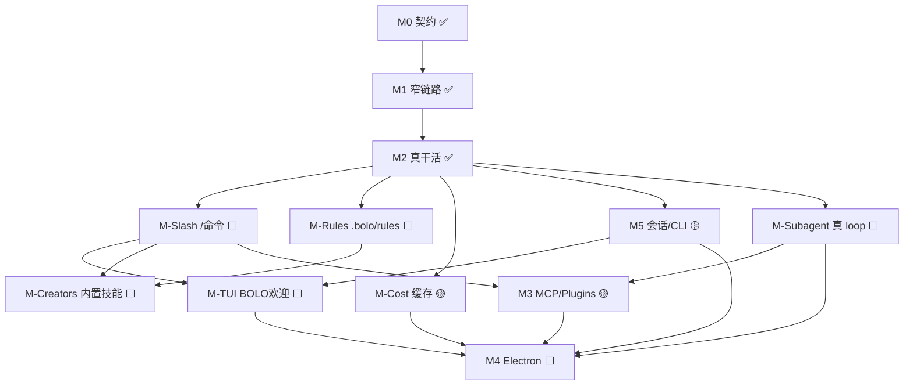

# Bolo Code 整体路线图（详细版）

> 更新：C1–C5 prompt cache API 标记已落地（`promptCache.ts`）；执行序与勾选以 `docs/TODO.md` 为准。  
> 原则：先借鉴 HelsincyCode / pi / Codex **语义**，再实现；**无遥测**；文档无本机绝对路径。  
> 本文件回答：**做到哪 / 缺什么 / 为何缺 / 下一刀 / 验收**。专项细节仍以各 `docs/*.md` 为准。

---

## 0. 一句话进度

| 层 | 粗估 | 说明 |
|----|------|------|
| **Headless 核心（loop / tools / provider / compact / prompt）** | **~70–75%** | M0–M2 主切片已齐；默认值仍偏保守 |
| **会话与 CLI** | **~40%** | JSON 快照 + `bolo --resume`；JSONL / 斜杠 / 新建会话未齐 |
| **扩展面（MCP / Plugins）** | **~20–25%** | Skills 半完成；MCP/Plugins 骨架 |
| **Subagent（对照 HC AgentTool）** | **~55%** | S0–S7：真 `runSubagent` + Agent 工具 + `.bolo/agents`；侧链/fork 未做 |
| **项目规则 Rules（`.bolo/rules`）** | **~0%** | 仅有 BOLO.md；**无** rules 目录装载 |
| **内置元技能（skill-creator / plugin-creator…）** | **~0%** | 无自带 creator 技能包 |
| **成本与缓存（prompt cache / 稳定前缀 + API 标记）** | **~70%** | C1–C5 ✅：布局 + Anthropic `cache_control` + OpenAI `prompt_cache_key`；无 TTL/MC/break detection |
| **斜杠命令 `/xxx`（含 `/effort` `/rules`）** | **~0–5%** | **无** 命令总线 |
| **CLI TUI / 欢迎屏** | **~5%** | 仅 `--resume` + 极简 readline；**无** 启动欢迎 / **BOLO** 大字 / 会话 TUI |
| **Electron GUI** | **~5%** | 占位 |
| **产品整体（可日用 coding agent）** | **~35–40%** | 能脚本/半 CLI 干活；未到成熟交互 agent |

**当前主线候选（可并行）：**

1. **斜杠命令总线** + P0 命令（`/help` `/compact` `/context` `/effort` `/model`…）  
2. **Rules 系统** `.bolo/rules/**/*.md` + `/rules`  
3. **内置 skill-creator / plugin-creator**  
4. Prompt 缓存 — **C1–C5 已完成**；后置 TTL / break detection / cached MC  
5. 会话 JSONL — `docs/TODO_SESSION_JSONL.md`  
6. MCP stdio 真连接  
7. **Subagent 真实现** — 对照 HC `AgentTool` / `runAgent`（见 **§5b / M-Subagent**）  
8. **CLI TUI** — `bolo` 启动欢迎 + **BOLO** 字标 + 原创吉祥物（见 **§5c / M-TUI**）

---

## 1. 产品目标与硬优先级

| 目标 | 说明 |
|------|------|
| 跨平台 GUI | Electron（一致性优先）；**先 CLI TUI 可日用** |
| Headless Core | CLI / GUI / 自动化同一套 |
| **CLI 体验** | `bolo` 启动即欢迎 + 会话 UI；品牌 **BOLO** + 原创吉祥物 |
| 扩展面 | Skill · MCP · Hook · **Subagent** · 插件 |
| **Subagent** | 主会话可派生子 loop（Explore/Plan/general…）；对照 HC AgentTool |
| **项目规则 Rules** | `.bolo/rules` 约束文档，运行时注入；可 `/rules` 管理 |
| **元技能** | 自带 skill-creator、plugin-creator 等「造扩展」能力 |
| **可控成本** | 上下文裁剪 + **缓存命中** + **effort 档位** |
| **可操作会话** | 成熟 agent 的 `/` 命令（对照 HC `src/commands/*`） |
| 工程纪律 | 对照参考再写；无遥测 |

```
契约与文档
  → Agent loop + Hook + Permission
  → Provider + Tools + System prompt + Compact
  → 会话持久化 + CLI
  → 斜杠命令总线（含 /effort /rules /skills…）
  → CLI TUI（欢迎屏 BOLO + 吉祥物 + 会话区；贴 HC 布局语义）
  → Rules 装载 + BOLO.md 分层
  → 内置 creator 技能
  → 缓存/成本策略
  → Skills / MCP / Plugins
  → Subagent 真 loop（Agent 工具 + 定义目录）
  → Electron GUI
  → 生产化打磨
```

---

## 2. 能力矩阵（全景）

> 状态：✅ 可用 · 🟡 半成品 · ⬜ 缺失 · 🚫 明确不做

### 2.1 运行时核心

| 能力 | 状态 | 备注 |
|------|------|------|
| queryLoop / Hooks / 四档权限 | ✅ | Always-allow 规则表 ⬜ |
| buildTool + 分区并发 + 常用工具 | ✅ | 真 apply_patch ⬜ |
| 双 Provider SSE | ✅ | |
| System prompt + BOLO.md | ✅ | Rules 目录 ⬜ |
| Skill catalog + Skill 工具 | 🟡 | slash 调 skill ⬜ |

### 2.2 上下文 · 成本 · Effort

| 能力 | 状态 | 对资源的影响 |
|------|------|----------------|
| Full / auto / micro compact · PTL | ✅/🟡 | 降输入 token（auto 默认关） |
| Skill catalog-only | ✅ | 降输入 |
| **Effort 档位**（low/medium/high/max/auto） | ✅ | session + `/effort`；映射 max_tokens |
| Prompt Cache 友好前缀 + API 标记 | ✅ | C1–C5：stable/volatile + `cache_control` / `prompt_cache_key` |
| 大 tool_result 预算 | ✅ | 默认 50k chars 截断 + 可选 spill |
| `/context` `/cost` 本地可见 | ✅ | 用户感知占用（本地累计，无遥测） |

### 2.3 项目规则 Rules（**新标出 · 用户明确要求**）

| 能力 | 状态 | 说明 |
|------|------|------|
| **`.bolo/rules/**/*.md`** | ⬜ | 项目级约束；对齐 Antigravity「agent 目录下 rules」+ HC `.claude/rules/` 语义 |
| 用户级 `~/.bolo/rules/` | ⬜ | 可选全局规则 |
| 启动/每轮装载进 system 或 userContext | ⬜ | 与 BOLO.md **分层**：BOLO.md=项目说明；rules=可拆分约束包 |
| frontmatter：`paths` 作用域（仅匹配文件时注入） | ✅ | HC 语义最小版：`alwaysApply:false` + globs × `activePaths`；见 `docs/RULES.md` |
| **submitPrompt 刷新 path-scoped rules** | ✅ | 每轮从 messages 推 activePaths，仅换 volatile 的 `# Project rules`；stable 前缀不变 |
| `/rules` 列表 · 开/关 · 预览 | ⬜ | 斜杠入口 |
| 与 prompt cache 协同 | 🟡 | rules 变更会 cache break；API 标记已接；稳定排序 |

**建议目录（实现时写入 CONFIG）：**

```text
{cwd}/.bolo/
  BOLO.md                 # 项目总说明（已有装载）
  rules/
    code-style.md         # 任意 .md
    testing.md
    security.md
    foo.md                # 可选 YAML frontmatter: paths, alwaysApply, disabled
  skills/
  sessions/
~/.bolo/rules/            # 可选用户全局
```

**注入顺序（草案）：** 身份/系统规则 → Environment → **user rules** → **project rules** → BOLO.md → skill catalog。  
**预算：** 与 BOLO.md 类似单文件/合计字符上限，防规则炸上下文。

### 2.4 内置元技能 / Creator（**新标出**）

| 能力 | 状态 | 说明 |
|------|------|------|
| **skill-creator** | ⬜ | 引导创建/迭代 `SKILL.md`（对照 HC 官方 skill-creator 插件思路） |
| **plugin-creator** | ⬜ | 引导脚手架 `bolo.plugin.json` + contributes |
| rule-creator（可选） | ⬜ | 向导写 `.bolo/rules/*.md` |
| 随发行附带路径 | ⬜ | 如 `packages/bundled-skills/` 或安装时复制到 `~/.bolo/skills` |
| `/skill-creator` · `/plugin-creator` | ⬜ | 经 slash 调 skill（user-invocable） |

**完成定义：** 新用户不改 core 源码，只靠 `/skill-creator` 等即可产出可用 skill/plugin 目录结构。

### 2.5 会话与 CLI / TUI

| 能力 | 状态 |
|------|------|
| JSON 快照 + `bolo --resume <id>` | ✅ 必须带 id/path |
| **`bolo --resume`（无 id）→ 当前项目会话列表 + 交互选择** | ⬜ **缺口**；HC 有此体验，Bolo 未实现 |
| `listSessions`（按 cwd / project 过滤） | ⬜ 与上条共用；JSONL 规划 E1 相关 |
| `bolo --continue`（最近一条） | ✅ |
| JSONL transcript | ⬜ 规划 `TODO_SESSION_JSONL.md` |
| list / continue / **无参新建会话** `bolo` | ⬜ 现无参只打印 help / 报仅支持 resume |
| **启动欢迎屏（welcome）** | ⬜ 对照 HC logo/welcome 布局 |
| **大写 ASCII / 色块字标 `BOLO`** | ⬜ 品牌主标识（非 Claude 字样） |
| **原创吉祥物（小动物）** | ⬜ 终端安全 ASCII/ANSI 艺术；见 §5c 选型 |
| 会话区：流式文本 + 工具状态行 | ⬜ 极简 readline 有一点；无结构化 TUI |
| 输入框 / 权限确认 TUI | ⬜ |
| 完整 Ink 级 TUI | ⬜ 可分阶段：先 plain banner + readline，再 Ink |
| SQLite | 🚫 现阶段（HC 主路径 JSONL） |

### 2.6 斜杠命令 `/xxx`（**整体缺失** · 对照 HC 扩表）

见 **§5** 全表。摘要：

| 簇 | 示例 | 状态 |
|----|------|------|
| 总线 | 解析 `/`、help、skill 回落 | ⬜ |
| 会话 | `/clear` `/compact` `/context` `/cost` `/resume` `/session` | ⬜/🟡 |
| 模型与推理 | `/model` **`/effort`** `/plan` | ⬜ |
| 扩展 | `/skills` `/mcp` `/plugins` `/hooks` **`/rules`** | ⬜ |
| 元技能 | `/skill-creator` `/plugin-creator` | ⬜ |
| 工程 | `/init` `/diff` `/commit` `/review`… | ⬜ 后置 |
| 产品周边 | login/theme/vim/remote… | 🚫 或后置（HC 很多 Bolo 不抄） |

### 2.7 Subagent（对照 HC · **S0–S6 最小完成线 ✅**）

| 能力 | 状态 | HC 对照 | 说明 |
|------|------|---------|------|
| Hook 事件名 SubagentStart/Stop | ✅ 契约 | hooks | 输入类型已有 |
| `spawnSubagent`（原 stub） | ✅ 真 loop | — | 调 `runSubagent`；兼容别名 `spawnSubagentStub` |
| **Agent 工具**（主 agent 可 spawn） | ✅ | `tools/AgentTool` | `prompt` + `subagent_type`；`createDefaultTools` |
| **`runSubagent` 独立 queryLoop** | ✅ | `AgentTool/runAgent.ts` | 独立 messages、tools、system |
| **内置 agent 类型** explore / general | ✅ | `builtInAgents` | 工具白名单 + 专用 system |
| **项目/插件 agent 定义目录** | ✅ | `loadAgentsDir` | S7 `.bolo/agents/*.md` |
| 工具裁剪 `resolveAgentTools` | ✅ | `agentToolUtils` | 白名单；**禁嵌套 Agent** |
| 同步跑完回写主会话摘要 | ✅ | `finalizeAgentTool` | 最后 assistant 文本 → tool_result |
| 异步 / 后台 agent | ⬜ | async lifecycle | **P2**；先做同步 |
| Fork 继承父上下文 | 🟡 最小 | `fork` type / `fork:true` | 父 messages 浅拷贝 + 去 Agent；无 worktree / 无完整 cache 共享 |
| 子会话 transcript 侧链 | ⬜ | `agent-*.jsonl` | 与 JSONL 规划 Phase G 对齐 |
| `/agents` 或 slash 管理 | ⬜ | 可选 | P1 |
| 遥测 / GrowthBook 门控 fork | 🚫 | HC 有 | **不抄** |

**Bolo 现状一句话：** S0–S7 已落地真 loop + Agent 工具 + 项目 `.bolo/agents`；侧链 / fork 未做。

### 2.8 扩展面 · GUI

| 能力 | 状态 |
|------|------|
| MCP stdio / Plugins 真加载 | 🟡 MCP stdio ✅ / Plugins ⬜ |
| Subagent 真 loop | ⬜ 见 §5b / M-Subagent |
| Electron | ⬜ |

---

## 3. 里程碑详述

### M0–M2 ✅

契约 → 窄链路 → 真 Provider / 工具 / system+BOLO / compact 链（含 micro、PTL）。详见历史提交。

### M2.9 / M-Cost — 缓存与 Token 🟡

见 **§4**。C1–C5（布局 + API cache 标记）已完成；tool 结果预算 / 1h TTL / break detection 后置。

### M2.10 / M-Slash — 斜杠命令 ⬜

见 **§5**。含 **`/effort`**、**`/rules`**，以及调 skill/creator。

### M2.11 / M-Rules — 项目规则目录 ⬜ **新里程碑**

| # | 切片 | 验收 |
|---|------|------|
| R1 | 发现 `.bolo/rules/**/*.md` + 可选 `~/.bolo/rules` | 单测临时目录 |
| R2 | 注入 system/userContext + 字符预算 | `test-rules`；与 BOLO.md 并存 |
| R3 | frontmatter：`disabled` / `alwaysApply` / `paths`（activePaths 匹配） | ✅ |
| R4 | `/rules` `[list\|show\|enable\|disable]` | 依赖 M-Slash |
| R5 | `bolo-init` 创建空 `rules/` + 示例 README | CONFIG 更新 |
| R6 | 文档 `docs/RULES.md` | 与 Antigravity/HC 差异说明 |

### M2.12 / M-Creators — 内置 creator 技能 ⬜ **新里程碑**

| # | 切片 | 验收 |
|---|------|------|
| K1 | 仓库内 `bundled`：`skill-creator` SKILL.md | 发现进 catalog |
| K2 | `plugin-creator` SKILL.md | 脚手架步骤可执行（至少写文件说明） |
| K3 | 可选 `rule-creator` | 写 rules 模板 |
| K4 | slash：`/skill-creator` 等 | 依赖 M-Slash skill 回落 |
| K5 | README：如何用 creator 扩展 Bolo | 无遥测、无强制联网市场 |

### M3 — 扩展面 🟡

| # | 切片 | 状态 |
|---|------|------|
| 3.1 Skills 打磨 | 🟡 |
| 3.2 MCP stdio | ✅ |
| 3.3 Plugins 真加载 | ⬜ |
| **3.4 Subagent** | 🟡 S0–S6 ✅ → **见 M-Subagent / §5b** |

Creator 产出物（skill/plugin）挂 3.1/3.3；**子代理定义**可挂 `.bolo/agents`。

### M3.4 / M-Subagent — 子代理真实现 🟡 **S0–S6 最小完成线 ✅**

> 参考（只读）：HC `tools/AgentTool/{AgentTool,runAgent,agentToolUtils,builtInAgents,forkSubagent,loadAgentsDir,prompt}.ts`  
> Bolo：`docs/SUBAGENT.md` + `packages/core/src/subagent.ts`（`runSubagent` / Agent 工具）。

#### 目标语义（最小可用）

```text
主 queryLoop
  → 模型调用工具 Agent（或 Task）
  → SubagentStart hook
  → 子 session：裁剪 tools + 专用 system + 独立 messages
  → 子 queryLoop（可限 maxTurns）
  → 汇总文本 / 关键路径 → 父 tool_result
  → SubagentStop hook（可带 agent_transcript_path）
  → 父继续
```

#### 切片与验收

| # | 切片 | 验收 |
|---|------|------|
| **S0** ✅ | 文档 `docs/SUBAGENT.md`：类型、工具策略、禁止递归规则 | 与 ARCHITECTURE 一致 |
| **S1** ✅ | `AgentDefinition` 类型 + 内置表：`explore`（只读工具）、`general`（默认可写）、可选 `plan` | 单测 resolve |
| **S2** ✅ | `resolveAgentTools(def, allTools)`：白名单/黑名单；**默认禁止子 agent 再调 Agent**（防递归） | 测 |
| **S3** ✅ | `runSubagent({ def, prompt, parentCtx })`：真 `queryLoop`；独立 messages；继承 cwd/provider/hooks 子集 | `test-subagent` mock provider |
| **S4** ✅ | 注册 **Agent 工具**（`createDefaultTools` = builtins + Agent）；schema：`prompt` + `subagent_type` | 父 smoke：模型可 spawn（mock） |
| **S5** ✅ | 替换 `spawnSubagentStub` → 调 `runSubagent`；smoke 移除假完成 | smoke-turn 不假完成 |
| **S6** ✅ | 结果回写：`finalize` 摘要（最后 assistant 文本）；失败 is_error | 测 |
| **S7** ✅ | 项目定义：`.bolo/agents/<id>.md` frontmatter（tools、permissionMode、system body） | 发现 + 项目覆盖同名内置 |
| **S8** | 权限：子 agent 可用更严 mode（explore→偏只读）；仍走 PermissionGate | 测 |
| **S9** | 侧链落盘（可选）：`sessions/<parent>/agent-<id>.jsonl` 或同目录 sidecar | 依赖 JSONL 规划 |
| **S10** | 并行：同轮多个 Agent tool_use → 受 `isConcurrencySafe` 约束（默认 **false** 串行更安全） | 文档写清 |
| **S11** | `/agents` list 类型；主 system 的 session_guidance 提一句「可用 Agent 工具」 | 依赖 M-Slash / prompt |
| **S12** | Fork 继承父 messages（HC fork 极简） | ✅ 最小（`subagent_type` 省略/`fork`/`fork:true`；无 worktree） |
| **S13** | 异步后台 + 通知 | **P2** |
| **S14** | Worktree 隔离目录 | **P2** |

#### 内置类型建议（第一刀）

| `subagent_type` | 工具策略 | system 要点 |
|-----------------|----------|-------------|
| `explore` | Read/Glob/Grep（+ 只读 MCP 后置） | 只调研，不改文件；输出结构化发现 |
| `general` | 默认同主会话但 **无 Agent 工具** | 执行子任务并回报 |
| `plan`（可选） | 只读 + 写 plan 文件策略可后置 | 出方案不直接大改 |

#### 刻意不抄（HC）

- GrowthBook / 实验门控 fork  
- 全套 teammate / swarm / remote agent  
- Perfetto / 遥测 agent 注册  
- 复杂 UI 分组渲染（GUI 后再做）  

#### 依赖与顺序

```text
S0 文档
  → S1–S3 运行时（可无 slash）
  → S4–S6 Agent 工具挂主 loop   ← 最小「真 subagent」完成线
  → S7 目录定义
  → S8–S11 权限/落盘/slash/prompt
  → S12+ fork/async
```

**与 MCP：** 子 agent 的 tools 列表可在 MCP 就绪后 `resolveAgentTools` 一并过滤。  
**与 JSONL：** 侧链文件格式跟 `TODO_SESSION_JSONL` Phase G。  
**与 cache：** 子 agent **独立** system/tools → 不共享父 prompt cache（预期）；fork 路径才追求 cache 共享（P2）。

### M4 — Electron ⬜

门禁建议：Slash P0 + Rules 可注入 + resume/list 可用后再重开；Subagent UI 卡片后置。

### M5 — 生产化 🟡

| # | 切片 | 状态 |
|---|------|------|
| 5.1 会话持久化 | 🟡 JSON ✅ → JSONL 规划中 |
| 5.2 CLI 入口 | 🟡 `--resume <id>` ✅；**无 id 列表选择 ⬜**；无参启动 / TUI 见 M-TUI |
| 5.3 多平台构建 | ⬜（GUI 后置；CLI 先跨平台） |
| 5.4–5.4b micro + PTL | ✅ |
| 5.5 真 patch | ⬜ |
| 5.6 本地 trace | ⬜ |

### M5.T / M-TUI — CLI 终端 UI 与品牌欢迎 ⬜ **新里程碑**

> 用户目标：`bolo` 启动 agent 后立刻看到 **欢迎页 + 展示 UI**；字标 **大写 BOLO**；参考 HC 欢迎/会话壳；并有 **独特原创小动物吉祥物**。  
> 参考（只读）：HC 启动 logo / welcome / Ink REPL 布局语义——**抄结构不抄商标与文案**。

#### 启动体验（目标）

```text
$ bolo                         # TTY：欢迎 + 新会话 REPL
$ bolo --resume                # 无 id：列出**当前项目**会话 → 用户选择进入（对齐 HC）
$ bolo --resume <id|path>      # 直接恢复；欢迎可缩短
$ bolo --continue              # 恢复 mtime 最新一条（可选捷径）
$ bolo -p "…"                  # 可 --no-banner 跳过装饰
$ bolo < cmd                   # 非 TTY：无 ANSI 花活，纯文本
```

#### `bolo --resume` 无 id：项目会话选择器（对齐 HC · **必须补齐**）

| 项 | 约定 |
|----|------|
| 触发 | `bolo --resume` / `bolo -r` **不带** id；或 `--resume=` 空（若解析支持） |
| 范围 | **与当前 cwd 相关的项目会话**（默认 `{cwd}/.bolo/sessions/*`）；**不**默认混入无关全局会话，除非显式 `--scope user` / flag |
| 列表字段 | id · updatedAt · 消息数或 preview（首条/末条 user 摘要）· 可选 model |
| 交互 | TTY：编号选择 / 方向键（P1 Ink）；非 TTY：打印列表并要求 `--resume <id>`，exit ≠0 |
| 空列表 | 提示「无会话」并建议 `bolo` 新建 |
| 实现依赖 | `listSessions({ cwd, scope: 'project' })`（可先扫 JSON 快照，后接 JSONL） |
| 现状 | `parseArgs` **强制** resume 要 value；无选择器 → **产品缺口** |

切片建议并入 M5.2 / M-TUI 协同：

| # | 切片 | 优先级 |
|---|------|--------|
| **RS1** | `listProjectSessions(cwd)` 扫 `.bolo/sessions` | P0 |
| **RS2** | `bolo --resume` 无参 → 打印编号列表 + readline 选号 | P0 |
| **RS3** | 选中后走现有 `resumeSession` | P0 |
| **RS4** | 非 TTY 友好错误 | P0 |
| **RS5** | 与 JSONL 双格式列表 | P1（随 transcript 升级） |
| **RS6** | TUI 内美化选择（箭头/反色） | P1 |

#### 品牌与吉祥物（钉死方向）

| 元素 | 约定 |
|------|------|
| **字标** | 终端主标题为 **`BOLO`**（全大写）；可用 figlet 风格或手写多行 ASCII |
| **产品名** | 副标题可用 `Bolo Code` / `coding agent` |
| **吉祥物** | **原创**终端小动物（禁止照搬 Claude/龙虾、Cursor 等既有 IP） |
| **候选设定（实现前定稿 1 个）** | 见下表；ASCII 需在 Windows Terminal / 常见 monospaced 下可读 |
| **色** | 可选 16/256 色；`NO_COLOR` / 非 TTY 降级纯文本 |
| **无障碍** | `--plain` / `BOLO_PLAIN=1` 关闭吉祥物与色块，只留一行 `BOLO` |

**吉祥物候选（原创草案 · 择一写进 `docs/BRAND.md`）：**

| 代号 | 形象方向 | 气质 |
|------|----------|------|
| **Bolot** | 圆滚滚的**河豚 / 小气球鱼**（bolo≈球） | 谨慎但鼓劲；「可膨胀的上下文」玩笑可内用 |
| **Nyxkit** | 小**夜行狐** + 工具腰带 | 探路、读代码 |
| **Pipkin** | 小**田鼠**抱卷轴/diff | 勤恳改文件 |
| **Glim** | 小**萤火虫** | 照亮上下文、省 token 的「小灯」 |

> 实现阶段输出 **定稿名 + 最终 ASCII 帧**（可 1 静态 + 1 可选 blink）；不强制动画。

#### 切片与验收

| # | 切片 | 验收 |
|---|------|------|
| **T0** | `docs/TUI.md` + `docs/BRAND.md`：布局线框、字标、吉祥物定稿、HC 对照与不抄清单 | 文档 |
| **T1** | `renderWelcomeBanner()`：多行 **BOLO** + 吉祥物 ASCII + 版本/cwd/model 一行 | 单测快照（去色） |
| **T2** | `bolo` **无参 TTY** → 新会话 + banner + 输入循环（接 `submitUserInput`/现有 prompt） | 手工 + 测 parse |
| **T3** | 状态行：phase / permissionMode / effort（有则）/ 消息数 | 更新不闪屏乱序（尽力） |
| **T4** | 流式 assistant 输出 + tool_start/end 简行（对照 HC 时间线简化） | mock provider |
| **T5** | 权限 ask：TTY 下 y/n（或数字）选择；非 TTY 保持策略 | 测 |
| **T6** | 与 **M-Slash** 合流：输入 `/` 走总线；`/help` 在 TUI 内可读 | |
| **T7** | `--resume <id>` 缩略 banner；**`--resume` 无 id → 项目会话列表选择（RS1–RS4）** | 对齐 HC；测 |
| **T7b** | `--continue` 最近会话 | ✅ |
| **T8** | 可选 Ink/React 终端框架升级完整布局 | **P1**；T1–T7 可用零依赖 |
| **T9** | 主题 / 窄终端换行 / 吉祥物开关 | P1 |
| **T10** | 与 Electron 共享「品牌资源」（同一 ASCII 源文件） | M4 时 |

#### 布局线框（目标态 · 示意）

```text
  [吉祥物 ASCII]     BBBB    OOOO   L       OOOO
                     B   B  O    O  L      O    O
                     BBBB   O    O  L      O    O
                     B   B  O    O  L      O    O
                     BBBB    OOOO   LLLLL   OOOO
  Bolo Code  ·  headless coding agent  ·  v0.x
  cwd: …  ·  model: …  ·  mode: default
  ─────────────────────────────────────────────
  (conversation / tool lines)
  ─────────────────────────────────────────────
  bolo>
```

#### 与 HC 对齐 / 不抄

| 对齐 | 不抄 |
|------|------|
| 启动即品牌 + 会话壳 | Claude 商标、官方 logo、龙虾 IP |
| 欢迎信息密度（cwd/model/tips） | 账号/订阅/遥测提示 |
| REPL 输入与 slash 同一入口 | 全量 Ink 组件与键位体系第一刀 |
| 非 TTY / pipe 静默 | 强制彩色动画 |

#### 依赖

- **硬依赖：** CLI 能 **新建会话**（不止 resume）  
- **强协同：** M-Slash（T6）、权限 ask UI（T5）  
- **弱依赖：** Subagent 进度展示（后置卡片）  
- **不阻塞：** Electron（M4）；TUI 是 headless 日用壳  

---

### M6 — 体验 ⬜

插件市场 UX、TUI 主题包、吉祥物节日帧等；**不做**远程遥测。


---

## 4. 缓存与 Token / Effort（摘要）

两种省资源手段常被混谈：

| 种类 | 作用 | Bolo |
|------|------|------|
| 上下文裁剪 | 少送字 | micro/full/catalog **有** |
| Prompt Cache | 前缀命中 | **C1–C5 ✅**（布局 + API 标记；TTL/MC/break 后置） |
| **Effort** | 同一模型下推理强度 | **无**（HC：`/effort low\|medium\|high\|max\|auto`） |

**Effort 规划要点（贴 HC，无遥测）：**

- Session 字段 `effortLevel`；可持久化到会话快照（`SessionSnapshot`）  
- 映射到 provider：`max_tokens` / thinking / reasoning 强度（按厂商能力，**能映射多少做多少**）  
- `/effort` 无参：显示当前；有参：设置；`auto`：清会话覆盖  
- 与 `/model` 可联动（HC model UI 会显示 effort）  
- **不**把 effort 塞进会破坏 cache 的随意位置；变更 effort 允许 cache break（预期行为）

M-Cost：**C1–C5 已完成**（`PROMPT_CACHE.md`、stable/volatile、`promptCache.ts`、Anthropic `cache_control`、OpenAI/Responses `prompt_cache_key`、`test-prompt-cache` / `test-provider-unit`）。  
**后置：** tool 结果预算加深、1h TTL / global scope、cached microcompact、cache break detection。

---

## 5. 斜杠命令详表（对照 HelsincyCode `src/commands/*`）

> HC 命令极多（TUI/账号/远程/主题等）。Bolo **只抄语义相关、无遥测、服务 coding agent** 的子集。  
> 状态均为 ⬜，除非另标。

### 5.1 路由语义（目标）

```text
输入以 / 开头
  → 内置命令注册表
  → 插件/MCP 贡献命令（后）
  → 同名 skill（user-invocable）  ← 含 skill-creator / plugin-creator
  → 未知：help 提示
```

### 5.2 P0 — 必须先有（无则「不像 agent」）

| 命令 | HC 参考 | Bolo 行为 |
|------|---------|-----------|
| `/help` | help | 列命令 + 可调 skill/creator |
| `/compact` | compact | `compactSession`；可选 note |
| `/clear` | clear | 清对话（保留 id/配置策略要定） |
| `/context` | context | 消息数、字符粗算、mode、model、effort、rules 数 |
| `/model` | model | 显示/切换模型 |
| **`/effort`** | **effort** | **low \| medium \| high \| max \| auto** |
| `/plan` | plan | 切 `permissionMode=plan` 或规划态 |
| `/permissions` | permissions | 显示/切换四档（可简化） |

### 5.3 P1 — 扩展与规则（你点名的 + 生态）

| 命令 | HC 参考 | Bolo 行为 |
|------|---------|-----------|
| **`/rules`** | （HC 偏 `.claude/rules` 自动加载；Bolo **显式命令**） | list / show \<file\> / enable / disable；提示目录 `.bolo/rules` |
| `/skills` | skills | 列 catalog |
| `/skill` · `/<skill-id>` | skill 调用 | 注入 skill 正文；尊重 frontmatter |
| **`/skill-creator`** | 官方 skill-creator 插件 | 调内置 skill-creator |
| **`/plugin-creator`** | plugin 生态 | 调 plugin-creator |
| `/mcp` | mcp | 依赖 MCP 真连接后：list/status |
| `/plugins` | plugin | 依赖 plugins：list/reload |
| `/hooks` | hooks | 列已配置 hooks |
| `/cost` · `/usage` | cost / usage | 本地累计（有 usage 回传时） |
| `/resume` · `/session` | resume / session | 会话内恢复/列表 |
| `/config` · `/init` | config / init | 配置与项目脚手架（rules 目录一并创建） |
| `/memory` | memory | 后置（若做 memdir） |

### 5.4 P2 — 工程效率（可后置）

| 命令 | HC 参考 | 说明 |
|------|---------|------|
| `/diff` `/commit` `/commit-push-pr` | diff / commit* | git UX |
| `/review` `/security-review` | review* | 审查流 |
| `/export` `/copy` | export / copy | 导出对话 |
| `/branch` `/rewind` | branch / rewind | 会话分叉/回退（依赖 transcript） |
| `/status` `/doctor` | status / doctor | 诊断环境 |
| `/files` `/tag` `/rename` | files / tag / rename | 会话元数据 |
| `/reload-plugins` | reload-plugins | 热加载 |
| `/output-style` | output-style | 输出风格 |
| `/fast` | fast | 快速档（可与 effort 合并设计，避免两套） |
| `/agents` | （HC 偏 Agent 工具非 slash） | 列出内置/项目 `subagent_type`；调试用 |

### 5.5 明确后置或通常不抄（HC 有、Bolo 慎抄）

login/logout、privacy、theme、vim、voice、desktop、mobile、chrome、bridge、teleport、stickers、rate-limit 商业、远程 env、heapdump、大量 ant-only 命令等。  
**break-cache** 类：仅调试用，可进 doctor，不进默认 help。

### 5.6 实现落点

| 模块 | 职责 |
|------|------|
| `packages/slash` 或 `core/src/slash.ts` | 注册表 + dispatch |
| `submitUserInput` | slash vs 普通 prompt |
| `docs/SLASH_COMMANDS.md` | 契约权威 |
| `scripts/test-slash.ts` | 无 LLM 单测 |

---

## 5b. Subagent 对齐 HC（专节）

### 5b.1 现状 vs 目标

| | Bolo 现在 | 目标（贴 HC） |
|--|-----------|----------------|
| 启动 | **Agent 工具** / `spawnSubagent` → `runSubagent` | 同左 + S7 目录定义 |
| 执行 | 子 **queryLoop** + 独立 messages | 同左 |
| 类型 | `explore` / `general` | + 项目 `.bolo/agents` |
| 工具 | 按类型裁剪；禁嵌套 Agent | 同左 |
| 回写 | tool_result 摘要给父 | 可选文件列表 |
| 落盘 | 无 | 可选 agent 侧链 transcript |
| 完成定义 | ✅ S0–S7 绿 | S8+ 侧链/权限细化等 |

### 5b.2 模块落点（建议）

| 路径 | 职责 |
|------|------|
| `packages/core/src/subagent.ts` 或 `packages/agents/` | `AgentDefinition`、`runSubagent`、`resolveAgentTools` |
| `packages/tools` | `createAgentTool()` 进 builtins |
| `packages/core/index.ts` | 删除/降级 stub；export run API |
| `.bolo/agents/` | 项目自定义 agent md（S7） |
| `docs/SUBAGENT.md` | 契约权威（S0 ✅） |
| `scripts/test-subagent.ts` | mock 父子两轮 ✅ |

### 5b.3 与主 loop 的关系

- 子 loop **复用** 现有 `queryLoop` / `runTools` / PermissionGate / microcompact（子上下文独立准备 messages）。  
- 父 messages **不**自动灌进子（除非未来 fork）；子 prompt 必须自包含（HC 对 fresh agent 的 briefing 要求）。  
- `isConcurrencySafe(Agent)` 默认 **false**（串行），避免权限 UI 与 cwd 竞态；以后再开受控并行。

### 5b.4 红线

1. **禁止** 用 stub 勾选 ROADMAP 完成  
2. **禁止** 无限制递归 Agent（子默认去掉 Agent 工具）  
3. **禁止** 遥测  
4. 子 agent 失败必须 `is_error` 回父，不吞异常  

---

## 5c. CLI TUI / 欢迎与品牌（专节摘要）

> 详切片见 **M-TUI（§3）**。此处钉产品观感。

| 项 | 约定 |
|----|------|
| 入口 | TTY 下 `bolo` → 欢迎 + 新会话（非仅 help） |
| 字标 | 终端主视觉 **大写 `BOLO`** |
| 吉祥物 | 原创小动物 ASCII（候选 Bolot / Nyxkit / Pipkin / Glim，定稿写入 BRAND） |
| 结构参考 | HC 启动欢迎 + REPL 壳（布局密度、信息行） |
| 不抄 | 任何第三方商标、官方 logo、既有 IP 形象 |
| 降级 | 非 TTY / `NO_COLOR` / `--plain`：无装饰 |
| 技术 | 第一刀可零依赖 banner + readline；完整 Ink 为 P1 |

```text
packages/cli/src/tui/
  banner.ts      # BOLO 字标 + mascot 帧
  welcome.ts     # cwd/model/mode 信息行
  sessionView.ts # 消息与 tool 行（渐进）
  theme.ts       # 色与 plain
docs/TUI.md · docs/BRAND.md
```

---

## 6. Rules 与 BOLO.md 分层（设计钉死）

| 层 | 路径 | 用途 |
|----|------|------|
| 身份/系统 | 代码内 system sections | 产品行为、权限说明 |
| 用户规则 | `~/.bolo/rules/*.md` | 个人偏好约束 |
| 项目规则 | **`.bolo/rules/*.md`** | 团队/项目约束（Antigravity 式） |
| 项目说明 | `BOLO.md` / `.bolo/BOLO.md` | 总览、架构入口（已有） |
| 兼容 | `CLAUDE.md` / `AGENTS.md` | 已有兼容装载 |
| Skills | skills 目录 | 流程/领域知识，**不是**硬约束；可被 `/skill` 调 |

**不要**用 skill 冒充 rules：rules 应默认进入上下文（受预算约束）；skill 默认 catalog-only。

---

## 7. 其它易漏模块检查单

| 模块 | 状态 |
|------|------|
| 斜杠总线 · `/effort` · `/rules` | ⬜ |
| `.bolo/rules` | ⬜ |
| skill-creator / plugin-creator | ⬜ |
| **Subagent 真 loop / Agent 工具** | ✅ S0–S7；侧链/fork 未做 |
| Prompt cache 布局 + API 标记 | ✅ C1–C5 |
| JSONL transcript · agent 侧链 | 规划 |
| Usage 本地记账 | ⬜ |
| Model 目录与别名 | ⬜ |
| Undo / worktree / 多模态 / 沙箱 | ⬜ 后置 |
| 遥测 | 🚫 |

---

## 8. 包职责演进

| 包 | 下一演进 |
|----|----------|
| `core` | slash · rules · effort · transcript · **`runSubagent`** |
| `config` | layout 含 `rules/` · **`agents/`**；bolo-init |
| `tools` | **Agent 工具** · 真 patch |
| `skills` | bundled creators · slash 调用 |
| `plugins` | plugin-creator 产出对接 |
| `agents`（可选新包） | 定义加载；或先放 core |
| `slash` | **新建** |
| `cli` | REPL 全面 `submitUserInput` |
| `providers` | effort 映射 · usage · cache 头 |

---

## 9. 建议排期（更新）

### 轨道 A — 交互（优先「像成熟 agent」）

1. 斜杠总线 + P0（含 **`/effort`**）  
2. **`/rules` 桩** + **R1–R2 rules 装载**（可先 list 目录，再注入）  
3. `/skills` + skill 回落  
4. **K1–K2 creators** 随仓库分发 + slash 调起  

### 轨道 B — 成本

C1–C5 前缀稳定 + API cache 标记 → tool 结果预算加深；effort 与 model 文档化。

### 轨道 C — 存盘

`TODO_SESSION_JSONL.md` A+B → resume/list/continue。

### 轨道 D — 扩展

1. **M-Subagent S0–S6**（Agent 工具 + 真 loop；可与 MCP 并行）  
2. MCP stdio  
3. plugins 真加载  
4. Subagent S7+ 目录定义 / 侧链  

### 轨道 E — CLI TUI / 品牌 / resume 选择器

1. **RS1–RS4（P0）**：`bolo --resume` **无 id** → **当前项目**会话列表 + 交互选择（对齐 HC）  
2. **T0–T2**：banner（**BOLO** + 吉祥物）+ `bolo` 无参新会话  
3. **T3–T6**：状态行、流式/工具行、权限 y/n、接 slash  
4. **T8+**：可选 Ink 升级、主题  

### 轨道 F — Electron GUI

Slash + Rules + **TUI 可用** + 可 list 会话后再上 Electron；Agent 进度卡片更后。

**默认推荐下一刀（交互）：**  
**A1 斜杠总线** → **R1 rules**；并行 **T0–T1 banner**。  

**默认推荐下一刀（会话恢复体验 · 对齐 HC）：**  
**RS1–RS4**（`bolo --resume` 无 id 列表选择）— 见 **`docs/TODO.md` P0**。  

**默认推荐下一刀（扩展/深度）：**  
**M-Subagent S0–S6**。

**默认推荐下一刀（「能看见产品」）：**  
**M-TUI T0–T2**。

**执行优先级总表：** → **`docs/TODO.md`**（唯一勾选入口，避免多文档打架）。

---

## 10. 工作方式与红线

1. 参考 HC `commands/*`、`AgentTool`/`runAgent`、启动 welcome/logo **布局**、rules、effort → findings → 最小切片 → 测绿 → **更新本文件**  
2. mock 不冒充 MCP/Plugins/**Subagent** 完成  
3. Compact 禁止无摘要 truncate  
4. 改 system 布局要考虑 cache break  
5. **禁止遥测**（HC effort/agent 里的 logEvent **不抄**）  
6. rules/creator **不**要求联网市场即可用  
7. Subagent **禁止**无限递归；子默认无 Agent 工具  
8. TUI **禁止**抄袭第三方商标/IP；吉祥物必须 **原创**；提供 plain 模式  

---

## 11. 文档地图

| 文档 | 用途 |
|------|------|
| **本文件** | 总路线 |
| **`TODO.md`** | **总任务清单 + 优先级（执行入口）** |
| `TODO_SESSION_JSONL.md` | JSONL 会话（含 agent 侧链 Phase G） |
| `SYSTEM_PROMPT.md` · `PROMPT_CATALOG.md` | 提示词 |
| `PROMPT_CACHE.md` | 静态/动态边界 + API cache 标记（C1–C5） |
| `SLASH_COMMANDS.md` | **待写** |
| `RULES.md` | **待写**（`.bolo/rules` 契约） |
| `SUBAGENT.md` | Agent 工具 / 类型 / 与 HC 差距（S0 ✅） |
| `TUI.md` · `BRAND.md` | **待写**（欢迎布局、BOLO 字标、吉祥物定稿） |
| `SKILLS.md` | Skills；将补 bundled creators |
| `COMPACTION.md` · `SESSIONS.md` · `CONFIG.md` | 压缩/会话/配置 |
| `ENGINEERING_PRINCIPLES.md` | 纪律 |

---

## 12. 近期 main 提交水位

| commit | 内容 |
|--------|------|
| `1c224ce` | CLI `--resume` |
| `6db82a8` | session JSON |
| `b134891` | micro + PTL |
| `257c736` | permission 文案 |
| `e56c32d` | system / BOLO / auto-compact |
| `13e026c` | tool calling |
| `3678e4b` | core · 双 provider · config |

---

## 13. 总览表（汇报用）

| 里程碑 | 状态 | 一句话 |
|--------|------|--------|
| M0–M2 | ✅ | 可测 headless 真干活 |
| **M-Slash** | ⬜ | `/` 总线；**含 `/effort`** |
| **M-Rules** | ⬜ | **`.bolo/rules` + `/rules`** |
| **M-Creators** | ⬜ | **skill-creator / plugin-creator** |
| **M-Subagent** | 🟡 | **S0–S7 ✅（含 `.bolo/agents`）；侧链/fork 未做** |
| **M-TUI** | ⬜ | **`bolo` 欢迎 + BOLO + 吉祥物；含 `--resume` 无 id 列表** |
| M-Cost | 🟡 | **C1–C5 ✅** 布局 + API cache 标记；TTL/MC/break 后置 |
| M3 | 🟡 | MCP/插件 + Subagent 真做 |
| M5 | 🟡 | 会话/CLI；**resume 无 id 列表 ⬜**；TUI 挂 M-TUI |
| M4–M6 | ⬜ | Electron 与体验 |

**一句话：**  
核心 loop 约七成；日用缺口优先——**`bolo --resume` 无 id 选会话（对齐 HC）**、**斜杠**、**BOLO TUI**；另有 rules / creator / Subagent / 缓存 / JSONL / MCP；执行序见 **`docs/TODO.md`**。