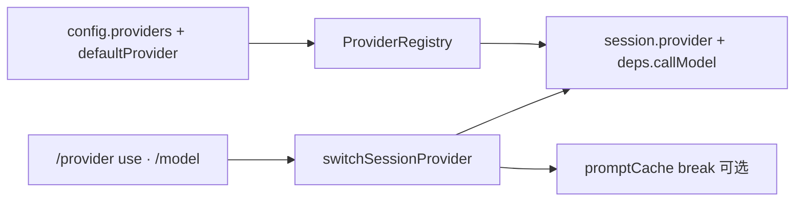

# Bolo Code 整体路线图

> **原则：** 日用主路径已收口 ≠ 相对 HC/Codex UI 密度 100%。无 stub 冒充完成。  
> **永不：** 遥测 · Claude/Codex **官方市场 API**。  
> **进度真源：** 本文 §0 / 各轨表格。  
> **使用手册：** [USAGE.md](./USAGE.md) · **Agent 交接：** [AGENT_HANDOFF.md](./AGENT_HANDOFF.md) · 仓库入口 [README.md](../README.md)

---

## 0. 一句话进度

| 层 | 粗估 | 说明 |
|----|------|------|
| **Headless 核心** | **~80–88%** | loop/STE/权限/auto/snip/policy/OS sandbox；partial stream fail-closed |
| 会话与 CLI | **~82–90%** | JSONL · new/resume 同构 runtime · slash · 每 turn 取消；Durable Turn DR0–DR2A ✅ |
| **扩展面** | **~80–88%** | MCP×3 · Skills · Plugins · WebFetch · OAuth 本地 |
| **Subagent** | **~85–92%** | Spec v0；worktree 隔离失败 fail-closed、dirty 成果保留 |
| **Rules / Creators** | **~75–85%** | 日用齐 |
| **成本与缓存** | **~94–97%** | /cost 日用近满 |
| **文件 Diff · 日用契约** | **~95%+** | **D0–D7 已收口**；见 [FILE_DIFF_SPEC.md](./FILE_DIFF_SPEC.md) |
| **文件 Diff · 交互 UI** | **~90–95%** | **U0–U4 已落地**（VM · 面板 · 审批 · cell · 行号/主题/轻量语法）；U5 真·Ink/IDE 可选 |
| **斜杠** | **~80–88%** | 日用 + polish |
| **CLI TUI（壳）** | **~70–80%** | 文本框布局/picker/主题；active Ctrl-C 取消本轮；**非**真 React Ink |
| **Electron GUI** | **~65–75%** | 壳 + 流式 + 权限 + 设置 + **多 provider（CX7）** |
| **Hooks · 日用契约** | **~96–98%** | **H0–H5 已落地**（SessionEnd · exit 语义 · updatedInput · `/hooks recent`）；trust/UI 菜单后置 |
| **Compact · 日用管道** | **~92–95%** | **C0–C5 已落地**；后置 partial/remote/真 tokenizer（§8.9） |
| **Provider · 多实例热切** | **~92–96%** | **P0–P4.1 + CX7 Desktop**；preset · 错误 · resume（见 §11） |
| **Effort · 推理强度方言** | **~92–95%** | **E0–E9** 已落地；按模型轻表裁档归 **CX2**；adaptive thinking 后置 |
| **Provider UX · 便利层** | **~95–98%** | **CX0–CX8 已落地**（含 ultrathink 默认 off）· [PROVIDER_UX.md](./PROVIDER_UX.md) |
| **产品整体（相对 HC）** | **~74–88%** | 日用高；UI 全家桶另计 |

**已闭环主线：** headless 日用 → Diff · Hooks · Compact · Provider · Effort · **Provider UX CX0–CX8** · **CLI/Agent 可靠性 R0–R4**。

**当前主线：** **Durable Turn DR2B**（§13：safe-boundary queue/steer/interrupt；DR2A 单 runner 已完成）。

**开放轨：**

Durable Turn DR0–DR2A 已落地，DR2B–DR4 继续开放；非阻塞加深项为 Compact §8.9 · U5 · adaptive thinking · Desktop 体验打磨。

---

## 1. 双轨模型（务必分清）

```text
轨 A · 日用契约（已完成 ~95%+）
  textDiff · meta · preview · fileDiffLog · /diff · git · resume · ANSI 摘要
  → 模型链干净；CLI/Desktop 能看懂改了啥

轨 B · 交互 UI 密度（规划 · 目标日用 UI ~90%+ / 全家桶不设 100%）
  可滚动 Diff 面板 · 权限内嵌 structured 预览 · 写后历史 cell
  → 对齐 HC DiffDialog / FileEditToolDiff · Codex diff_render 语义
  → 技术选型：优先「无重依赖」终端组件；可选真 Ink；Desktop 面板
```

| | 轨 A 日用 | 轨 B UI |
|--|-----------|---------|
| 目标 | 工作流正确、可查、可 resume | 浏览体验接近 HC/Codex |
| 现状 | D0–D7 ✅ | **U0–U4 ✅**；U5 真·Ink / IDE 可选 |
| 对标 | HC 工具结果 + Codex patch 摘要 | HC Ink 组件 + Codex ratatui |
| 不做 | — | 遥测 · 官方市场 · 必抄 React/Rust |

---

## 2. 文件 Diff · 轨 A（已完成）

| 阶段 | 交付 | 状态 |
|------|------|------|
| D0–D2 | textDiff · Edit/Write/apply_patch meta · fileDiffLog · `/diff` | ✅ |
| D3–D4 | 写前 preview · tool_end ANSI | ✅ |
| D5–D6 | git · transcript `file_diff` resume | ✅ |
| D7 | `createDiffSummary` · 默认短 unified · 更密 ask | ✅ |

详情：[FILE_DIFF_SPEC.md](./FILE_DIFF_SPEC.md) §0–§6。

---

## 3. 文件 Diff · 轨 B（Ink / ratatui 语义 · **规划**）

> **命名：** 文档称「Ink/ratatui 全家桶」= **对标体验**，不是必须引入 `ink` 或 `ratatui` crate。  
> Bolo 默认路径：**TypeScript 终端组件 + 复用 D 轨契约**；Desktop 共用同一 view-model。

### 3.1 对标什么

| HC (Ink) | Codex (ratatui) | Bolo U 轨应对 |
|----------|-----------------|---------------|
| `DiffDialog` + `useTurnDiffs` | history `new_patch_event` + pager | 可滚动会话/turn diff 面板 |
| `FileEditToolDiff` 权限内嵌 | apply_patch approval + 文件列表 | ask 内嵌 structured 预览（可滚） |
| `StructuredDiff` / 语法高亮 | `diff_render` 行号·折叠·语法 | 行级渲染器（先 ANSI 增强，后高亮） |
| `FileEditToolUpdatedMessage` | patch apply 历史 cell | 写后 transcript 风格 cell |
| `useDiffInIDE` | — | **后置 / 可选** |
| git merge-base / PR | — | **后置**（D5 已有 HEAD 级） |

### 3.2 架构（职责）

```text
packages/tools     已有：hunk / preview / ansi / git     （不变）
packages/core      已有：fileDiffLog / events / slash     （+ view-model 导出）
packages/cli/tui   新增：diffView · diffPane · 键位        （U 轨主战场）
apps/desktop       消费同一 DiffViewModel                 （U3）
```

**禁止：** 在 UI 里重算 diff 语义；只消费 `fileDiffLog` / `preview` / `meta` / git helper。

### 3.3 阶段 U0–U5

| 阶段 | 交付 | 相对「交互 UI」 | 状态 |
|------|------|-----------------|------|
| **U0** | 规格 + `DiffViewModel`（log/preview→可渲染行） | 契约 | ✅ |
| **U1** | **终端 Diff 面板**：`/diff` 可滚列表；j/k；Enter 展开；q 退出 | ~60–70% | ✅ |
| **U2** | **权限预览面板**：ask 多文件 + hunk 可滚；y/a/N | ~75–85% | ✅ |
| **U3** | **写后 History cell**；Desktop `<details>` 复用 | ~85–90% | ✅ |
| **U4** | 行号 · 主题色 · 轻量语法高亮（无 tree-sitter） | ~90–95% | ✅ |
| **U5** | 可选真·Ink / IDE / merge-base | 全家桶尾声 | 📋 |

### 3.4 U1/U2 行为（验收）

```text
用户: /diff
  → TTY 全屏/半屏面板（非一次性 dump）
  → 文件列表 + 总 +N/−M
  → 选中文件显示 structuredPatch / 或提示 /diff git
  → q / Esc 回到 REPL
非 TTY: 纯文本 /diff

权限 ask（Edit/Write/apply_patch 且有 preview.files）:
  → 同一面板 mode=approve
  → jk 浏览 · Enter 看 hunk · y allow · a always · n/q deny
  → BOLO_PERM_DIFF_PANEL=0 回落文本 [y/a/N]
```

### 3.5 技术选型（建议默认）

| 方案 | 优点 | 缺点 | 建议 |
|------|------|------|------|
| **A. 自研 TTY pane**（readline/raw mode，类似 arrowPicker） | 无新依赖；与现 cli 一致 | 能力上限低于 Ink | **U1–U3 默认** |
| **B. 引入 React Ink** | 对齐 HC 生态 | 依赖重；Electron 已占 GUI | U5 可选 |
| **C. 只做 Desktop 面板** | 实现快 | CLI 用户无感 | 与 A 并行 U3，不替代 CLI |
| **D. 嵌 ratatui/Rust** | 对齐 Codex | 双语构建复杂 | **不做** |

### 3.6 明确不做（U 轨内）

- 遥测 / LOC counter  
- 必抄 HC `StructuredDiff` native 模块  
- 必引入 ratatui  
- 把大 patch 写入模型 message  

### 3.7 文档入口

| 文档 | 角色 |
|------|------|
| 本文件 §3 | U 轨总规划 |
| [FILE_DIFF_SPEC.md](./FILE_DIFF_SPEC.md) | D 轨完成态 + U 轨切片 |
| [TUI.md](./TUI.md) | CLI 壳 + U 轨挂载点 |

---

## 4. 产品目标（主线）

| 目标 | 状态 |
|------|------|
| Headless Core | ✅ |
| CLI 可日用 | ✅ |
| Skill/MCP/Plugin/Subagent | ✅ |
| Electron 可用壳 | ✅（CX7 多 provider；非 HC 密度） |
| Diff 日用契约 D0–D7 | ✅ |
| Diff 交互 UI U0–U4 | ✅（U5 可选） |
| Hooks 日用 11 事件 + exit 语义 | ✅ **H0–H5** |
| Compact 日用管道打磨 | ✅ **C0–C5**（后置见 §8.9） |
| **多 Provider 热切** | ✅ **P0–P4.1**（§9）；Desktop **CX7** |
| **Effort 方言** | ✅ **E0–E9**（§10） |
| **Provider UX** | ✅ **CX0–CX8**（§11；ultrathink 默认 off） |
| **CLI / Agent 可靠性** | ✅ **R0–R4**（§12；流式终态 · runtime · 取消 · worktree · 门禁） |
| **Durable Turn** | ✅ **DR0–DR2A**（§13；DR2B–DR4 待做） |
| 无遥测 | ✅ |

---

## 5. 总览表（汇报）

| 里程碑 | 状态 | 一句话 |
|--------|------|--------|
| M0–M2 | ✅ | headless 主路径 |
| M-Loop / Tool / Compact / Slash | ✅ | 日用 |
| M-Subagent / Cost / MCP / JSONL | ✅ | 日用 |
| M-TUI（文本壳） | ✅ | 布局/picker/主题；非真 Ink |
| M4 Electron | ✅ | 壳 + 流式 + 权限 + Settings + 多 provider |
| **M-Diff-A（D0–D7）** | ✅ | 日用文件 diff 契约 |
| **M-Diff-B（U0–U4）** | ✅ U0–U4 | 交互 diff UI 主路径收口；U5 可选 |
| **M-Hooks（H0–H5）** | ✅ H0–H5 | SessionEnd + exit + updatedInput + `/hooks recent` |
| **M-Compact（C0–C5）** | ✅ C0–C5 | keep · usage · mid-turn · reinject · /context；后置 §8.9 |
| **M-Provider（P0–P4.1）** | ✅ | 多 provider + `/provider` 热切 + picker；见 §9 |
| **M-Effort（E0–E9）** | ✅ | 方言引擎 · choosable · 门控 · TTY · doctor |
| **M-Provider-UX（CX0–CX8）** | ✅ | preset · caps · errors · resume · Desktop · ultrathink |
| **M-Reliability（R0–R4）** | ✅ | provider fail-closed · new/resume 同构 · Ctrl-C · worktree 保全 · 默认门禁 |
| **M-Durable-Turn（DR0–DR4）** | ✅ DR0–DR2A | admission + lifecycle + recovery + 单 session runner；safe boundary/subagent/protocol 后续 |
| 官方市场 / 遥测 | 🚫 | 永不 |

**一句话：**  
主路径、Diff、Hooks、Compact、**多 Provider、Effort、Provider UX（含 CX8）、CLI/Agent 可靠性 R0–R4**日用已收口；Durable Turn 正在把“可恢复 transcript”升级为“可恢复执行”。

**下一刀（当前主线）：** Durable Turn **DR2B safe-boundary control**；随后 DR2C recovery projection → DR3 background/subagent → DR4 protocol。

**非阻塞加深：** Compact §8.9 · U5 · adaptive thinking · Desktop 体验打磨。

---

## 6. 文档地图

| 文档 | 用途 |
|------|------|
| 本文件 | **进度真源** · 总路线 + 各轨水位 |
| [USAGE.md](./USAGE.md) | **使用手册**（安装 · Provider · **Agent 配置**） |
| [AGENT_HANDOFF.md](./AGENT_HANDOFF.md) | **交接手册**（架构 · 入口 · 反模式） |
| [PROVIDERS.md](./PROVIDERS.md) | Provider 协议与多实例 |
| [PROVIDER_UX.md](./PROVIDER_UX.md) | CX 便利层（preset · caps · ultrathink） |
| [EFFORT.md](./EFFORT.md) / [EFFORT_OPTIMIZATION.md](./EFFORT_OPTIMIZATION.md) | Effort 方言 |
| [COMPACTION.md](./COMPACTION.md) | Compact 契约；§8.9 后置 |
| [HOOKS.md](./HOOKS.md) | Hook 契约 |
| [FILE_DIFF_SPEC.md](./FILE_DIFF_SPEC.md) | Diff 契约与阶段 |
| [TUI.md](./TUI.md) | CLI TUI 壳与 U 挂载 |
| [CONFIG.md](./CONFIG.md) | 配置布局 |
| [ARCHITECTURE.md](./ARCHITECTURE.md) | 架构 |
| [SUBAGENT_SPEC.md](./SUBAGENT_SPEC.md) | Subagent 契约 |
| [ENGINEERING_PRINCIPLES.md](./ENGINEERING_PRINCIPLES.md) | 工程原则 · 禁止遥测 |
| `apps/desktop/README.md` | 桌面 |
| `TODO*.md` | 历史轨（**只读**，非现行真源） |

---

## 7. Hooks 轨（H0–H5 · **规划 · SessionEnd 必做**）

> **口径：** 日用 = 契约事件齐全 + 主路径接线 + exit 语义可依赖。  
> **不对齐 100%：** HC ~26 事件全家桶 · http/prompt/agent handler · trust/managed · Ink HooksConfigMenu · 遥测。  
> **对标：** Codex `HOOK_EVENT_NAMES` **11 事件**（Bolo 原 10 + **SessionEnd**）；HC 共享核心语义。

### 7.1 现状水位（评估后）

| 项 | 状态 |
|----|------|
| 原 10 事件名 + `runHooks` 挂点 | ✅ 已接线 |
| command + timeout/abort + 配置合并 + `/hooks` | ✅ |
| **SessionEnd** | ✅ **H0** — `endSession` / `runSessionEndHooks`；`/clear` · REPL 退出 · Desktop destroy |
| Stop / SubagentStop **exit 2 续跑** | ✅ **H1**（预算默认 3） |
| PostToolUse **exit 2 → 模型** | ✅ **H2**（并入 tool_result） |
| SubagentStart **stdout 注入子上下文** | ✅ **H3** |
| PreToolUse **updatedInput** | ✅ **H4**（schema 校验；失败忽略改写） |
| `/hooks recent` 诊断 | ✅ **H5**（ring · 无遥测） |
| trust / managed / TUI browser | 后置（不对齐日用 95%） |

**粗估：** 日用 **~96–98%**（11 事件 + exit + rewrite + 诊断）；vs Codex 产品壳（trust/UI）另计。

### 7.2 目标与验收（H 轨完成定义）

1. **SessionEnd** 在会话真正结束路径触发（clear / 退出 / logout 等 reason），失败不拖垮进程  
2. Stop exit 2：stderr（或约定字段）可见于模型并**可续一轮**（对齐契约「继续对话」）  
3. SubagentStop exit 2：stderr 给子代理并**继续跑**（非默默忽略）  
4. PostToolUse exit 2：stderr **立即进入模型可见链**（非仅用户侧 emit）  
5. SubagentStart exit 0 stdout 可注入子代理上下文  
6. 单测覆盖 SessionEnd + 上述 exit 路径；无遥测  
7. `docs/HOOKS.md` 为真源；`HOOK_EVENTS` 含 SessionEnd

### 7.3 架构（职责不变）

```text
packages/shared     HOOK_EVENTS + 输入类型（+ SessionEnd）
packages/hooks      runHooks / matcher / command 归约（+ 事件分支）
packages/core       挂载点：endSession / queryLoop Stop / tool Post / subagent
packages/cli        可选：hook 失败/timeout 更可读（H5）
apps/desktop        会话关闭时走同一 endSession（勿只杀进程跳过 hook）
```

**禁止：** tool 内私自跑 hook；结束路径绕过 `SessionEnd`；把 hook 全文灌进无关 message。

### 7.4 阶段切片（建议实施顺序）

| 阶段 | 交付 | 优先级 | 状态 |
|------|------|--------|------|
| **H0** | **SessionEnd 必做**：契约 + 类型 + `endSession`/`close` 挂载 + reason matcher + 短超时 | P0 | ✅ |
| **H1** | **Stop / SubagentStop exit 2 续跑**：stderr→模型/子代理 + 再入 loop（有预算/防死循环） | P0 | ✅ |
| **H2** | **PostToolUse exit 2 → 模型可见**（并进 tool_result） | P0 | ✅ |
| **H3** | **SubagentStart injectText** 进子 `systemPromptSections` | P1 | ✅ |
| **H4** | **PreToolUse `updatedInput`**（JSON 改写 tool_input；失败则忽略改写） | P2 | ✅ |
| **H5** | `/hooks recent` · `/hooks failures` 诊断 ring | P2 | ✅ |
| 后置 | SessionEnd 以外的 HC 扩事件 · http/prompt/agent · trust/managed · FileChanged | — | 🚫 非本轨 |

**顺序硬约束：** **先 H0（SessionEnd）**，再 H1→H2（exit 语义），再 H3–H5。  
不在 H0 完成前扩散 Notification / Elicitation 等。

### 7.5 H0 · SessionEnd（契约草案）

```ts
// matcher: reason
type SessionEndReason =
  | 'clear'
  | 'logout'
  | 'prompt_input_exit'
  | 'other'
// 实现可增：'resume' 切换前结束旧会话 等；先对齐 HC 常用子集

type SessionEndInput = HookBaseInput & {
  hook_event_name: 'SessionEnd'
  reason: SessionEndReason | string
  transcript_path?: string
}

// 语义（对照 Codex/HC）：
// - exit 0：成功；stdout 默认可不展示
// - 其他：stderr 仅用户；**不**因 hook 失败阻止进程退出
// - 超时：短于普通 hook（建议默认 ~3s，上限更严）；teardown 必须有 headroom
```

挂载点（实现时选齐，禁止只写类型）：

| 时机 | reason 例 |
|------|-----------|
| `/clear` 或清空会话 | `clear` |
| CLI/Desktop 正常退出 | `prompt_input_exit` / `other` |
| 登出（若有） | `logout` |
| resume 替换旧会话前 | `other` 或显式 `resume`（若采用） |

### 7.6 H1–H2 · exit 语义（要点）

```text
Stop exit 2
  → 收集 continuation 文本（stderr 优先，或 JSON decision）
  → 注入为对模型可见的续跑输入
  → 再入 query（max 续跑次数，防 hook 互刷）

SubagentStop exit 2
  → 同类，作用域=子 loop，不抬升父权限

PostToolUse exit 2
  → stderr 立即对模型可见（transcript / 下轮 tool 反馈约定写进 HOOKS.md）
  → 不默默吞掉
```

### 7.7 明确不做（H 轨内）

- 遥测 / analytics  
- HC 全量 26 事件一次做完  
- Codex hook **trust** 与 managed-hooks-only 企业层（可另开轨）  
- 真·Ink HooksConfigMenu  
- `type: http|prompt|agent`（仍仅 command；字段可预留）

### 7.8 测试与提交

| 测试 | 覆盖 |
|------|------|
| `scripts/test-hooks-*.ts`（扩或新建） | SessionEnd 触发与 reason matcher |
| | Stop/SubagentStop exit2 续跑预算 |
| | PostToolUse exit2 模型可见 |
| | 超时/abort 回归（已有 s8） |

提交建议：`feat: hooks H0 SessionEnd` → `feat: hooks H1-H2 exit semantics` → `feat: hooks H3-H5 inject and UX`；只 stage 本轨。

### 7.9 文档入口

| 文档 | 角色 |
|------|------|
| 本文件 §7 | H 轨总规划与顺序 |
| [HOOKS.md](./HOOKS.md) | 事件/exit/挂载 **实现真源** |
| [ENGINEERING_PRINCIPLES.md](./ENGINEERING_PRINCIPLES.md) | 扩事件须先改 HOOKS |
| [AGENT_LOOP.md](./AGENT_LOOP.md) | loop 与 Stop 交叉（实现时同步） |

---

## 8. Compact 轨（C0–C5 · **日用已收口**）

> **口径：** 日用 = 摘要真管道 + 阈值/熔断可依赖 + 续作质量（keep）+ 触发时机（usage/mid-turn）+ 压后上下文不丢关键段。  
> **不对齐 100%：** HC partial / session-memory / cached API edits / reactive 全家 · Codex remote compact / window id / 换模触发。  
> **对标：** HC `compactConversation` + auto/snip/micro/PTL 语义；Codex 仅借「阈值与 mid-turn 意图」，不抄 remote。  
> **状态：** **C0–C5 ✅ 已落地**（~92–95% 日用）。下文保留为契约与**后置清单**；**不阻塞 P 轨**。

### 8.1 现状水位（评估后）

| 项 | 状态 |
|----|------|
| Full compact + Pre/Post hooks + 禁止 slice 冒充 | ✅ |
| Auto 阈值（chars 启发）+ 熔断 + env + `/autocompact` | ✅ |
| Snip 最小 + micro content-clear + prepare 链 | ✅ |
| PTL 截断重试（loop + summarizer 副本） | ✅ |
| jsonl `compact_boundary` + resume R1 | ✅ |
| **messagesToKeep 按 user 轮次 / token** | ✅ **C1** — `splitMessagesForCompactKeep`；默认智能 keep |
| **auto 阈值接 session usage（有则用）** | ✅ **C2** — `usageInputTokens` / `getUsageInputTokens` |
| **工具环中途接近阈值再 full 一次** | ✅ **C3** — `tryMidTurnCompact` · 每 outer turn ≤1 |
| **post-compact 最小再注入**（技能 catalog） | ✅ **C4** — `postCompactReinjection`（可关） |
| **`/context` 来源与策略** | ✅ **C5** — pressure source · keep · last compact |
| partial / remote / session memory / 真 tokenizer | 后置 |

**粗估：** 日用 **~92–95%**（C0–C5）；vs HC 全家桶 / Codex 窗口机另计。

### 8.2 目标与验收（C 轨完成定义）

1. Full compact 默认 **按 user 轮次** 保留尾部（可配）；禁止无摘要只 keep  
2. Auto 阈值：**优先**最近 API `input`/`total` usage（若 session 有），否则回落 `estimateTokens`  
3. 主 loop 在 **tool 批之后、下一 callModel 前** 可再判一次 auto（mid-turn 最小，有预算防连打）  
4. compact 成功后可选再注入 **短** skill catalog / path-rules 提示（不灌全文、不拆 cache-stable 前缀策略）  
5. `/context` 展示：阈值来源（usage vs estimate）、keep 策略、上次 compact 摘要长度  
6. 单测绿；失败不毁 messages；**无遥测**  
7. `docs/COMPACTION.md` 为真源

### 8.3 架构（职责）

```text
packages/compact     纯：keep 切分 · 阈值 · pressure · full/snip/micro/PTL
packages/core        挂：prepare 链 · compactSession · queryLoop mid 判 · 再注入
packages/cli         /context · /compact 文案消费 pressure + 策略说明
apps/desktop         可选展示 compact 状态（不大改壳）
```

**禁止：** core 内 `slice(-N)` 冒充 full；无 summarizer silent truncate；把大 transcript 塞回 model message；遥测。

### 8.4 阶段切片（实施顺序）

| 阶段 | 交付 | 优先级 | 状态 |
|------|------|--------|------|
| **C0** | 规格对齐：本 § + COMPACTION 日用缺口表；验收清单 | P0 | ✅ |
| **C1** | **messagesToKeep 按 user 轮次**（可选 token 上限）；manual/auto 默认可配 | P0 | ✅ |
| **C2** | **usage 感知阈值**：`shouldAutoCompact` 可读 last usage；无 usage 则启发 | P0 | ✅ |
| **C3** | **mid-turn 一次**：tool drain 后若超阈值且未本 turn compact → 试 auto full | P1 | ✅ |
| **C4** | **post-compact 再注入最小**：catalog 短段；可关 | P1 | ✅ |
| **C5** | `/context`·`/compact` 诊断加深 + 回归测 + 水位 ~92–95% | P2 | ✅ |
| 后置 | partial · remote · session memory · 真 tokenizer · cache_edits API | — | 🚫 非本轨 |

**顺序硬约束：** **C0 文档 → C1 keep → C2 usage → C3 mid-turn → C4 再注入 → C5 UX/测**。  
不在 C1/C2 完成前做 partial/remote。

### 8.5 C1 · keep 轮次（契约草案）

```ts
// packages/compact — 纯函数
type KeepTailOptions = {
  /** 保留最近 N 个 user 开启的 turn（含其后 assistant/tool）；默认建议 2–4 */
  keepRecentUserTurns?: number
  /** 可选：keep 段 token 上限，超出从 keep 头再裁 */
  keepMaxTokens?: number
}

/** 切点须在 user 边界，不拆开 tool_use/tool_result 对 */
function splitMessagesForCompactKeep(
  messages: ChatMessage[],
  opts?: KeepTailOptions,
): { toSummarize: ChatMessage[]; messagesToKeep: ChatMessage[] }
```

- `runFullCompact` / `compactSession` 默认走轮次 keep（或显式 `keepRecentUserTurns`）  
- 旧 `keepRecentMessageCount`：**兼容**，文档标 deprecated  
- 安全：tool_use 与对应 tool 结果不得分到 summarize/keep 两侧

### 8.6 C2 · usage 阈值

```ts
shouldAutoCompact({
  tokenCount,           // 启发
  usageInputTokens?,    // 最近成功 call 的 input/total（sessionUsage）
  contextWindowTokens,
  enabled,
  consecutiveFailures,
  querySource,
  env?,
})
// 有效计数 = usageInputTokens ?? tokenCount
```

- 有 provider usage 时 auto 更贴真实窗  
- `/context` 标明 `pressure source: usage | estimate`

### 8.7 C3 · mid-turn（最小）

```text
queryLoop:
  … tool drain …
  if auto on && shouldAutoCompact && !compactedThisTurn
    → compactSession(auto) 一次
    → 写回 messages；标记 compactedThisTurn
  → 下一轮 callModel
```

- 与 turn 初 prepare 的 auto **共用熔断**  
- 每 turn 最多 **一次** mid full（防死循环）  
- 失败：保持 messages，继续（同现 auto）

### 8.8 C4 · 再注入（最小）

compact 成功且非 override system 时：

- 可选刷新 **短** skill catalog 段（可复用 `replaceSkillCatalogSection`）  
- 不强制重跑全量 memory 正文  
- 开关：`postCompactReinjection?: boolean`（与现 system 装配一致即可）

### 8.9 明确不做 / 后置（C 轨日用外 · **未完成清单**）

> 以下**不是** C0–C5 欠债，而是对照 HC/Codex 的可选加深；**默认不排进当前主线**（主线转 §9 P 轨）。若单独开刀再立 C6+ 或独立轨。

| 项 | 来源 | 说明 | 建议 |
|----|------|------|------|
| **partial compact** | HC | 按索引 up_to/from 只摘要一段 | 后置；长会话成本优化 |
| **session memory compact** | HC 实验 | 用会话记忆代替再调 LLM | 后置；依赖 memory 轨成熟度 |
| **remote compaction** | Codex | 服务端 compact / v2 | 🚫 不追；Bolo 本地管道 |
| **window_id / auto_compact_window 记账** | Codex | 多窗状态机 | 后置；日用非必须 |
| **真 tokenizer** | 两边 | 替换 chars/4 启发 | 后置；C2 usage 已缓解 |
| **cache_edits API** | HC cached MC | 厂商缓存编辑 | 🚫；本地 content-clear 即可 |
| **path-rules 再注入** | C4 验收曾写 | 现仅 skill catalog | 可选小步；不阻塞 |
| **mid-turn 与 prepare 共享 consecutiveFailures** | 健壮性 | 现 mid 阈值用 failures=0 | 可选 polish |
| **`/compact` 显式 `--keep-turns N`** | UX | 契约字段已有，slash 可透传 | 可选小步 |

**禁止误判：** 不要把上表当成「C 轨没做完」；日用验收见 §8.2（已满足）。

### 8.10 测试与提交

| 测试 | 覆盖 |
|------|------|
| `test-compact` / `test-compact-c-track` | keep · usage · mid · reinject · /context |
| 回归 | `test-auto-compact` · `test-ptl-retry` · `test-snip` · `test-microcompact` · `test-context-slash` |

已提交切片（历史）：C0 docs → C1 keep → C2 usage → C3–C5 mid/reinject/context。

只 stage 本轨；**勿提交 `.bolo-tmp/`**。

### 8.11 文档入口

| 文档 | 角色 |
|------|------|
| 本文件 §8 | C 轨总规划与**后置清单** |
| [COMPACTION.md](./COMPACTION.md) | 管道/阈值/**实现真源** |
| [AGENT_LOOP.md](./AGENT_LOOP.md) | prepare / mid-turn 交叉 |
| [PROMPT_CACHE.md](./PROMPT_CACHE.md) | 稳定前缀 vs 再注入 |

---

## 9. Provider 轨（P0–P5 · **P0–P4.1 + CX7 已落地**）

> **用户痛点（已解）：** 曾只有单个 `config.provider`；现已支持 **`providers` 表 + 运行中热切**。  
> **目标：** 配置里同时登记多个 provider；agent 运行中 `/provider` / `/model` 热切，无需关闭进程。  
> **对标（语义，不抄实现/遥测）：** Codex model_providers · HC 运行时选模。  
> **Bolo 原则：** key 仍优先环境变量；**不**写遥测；**不**接官方市场。  
> **便利层：** preset / caps / resume / ultrathink 见 §11 · [PROVIDER_UX.md](./PROVIDER_UX.md)

### 9.1 现状水位

| 项 | 状态 |
|----|------|
| 单 `provider.kind` + env 推断 | ✅ |
| 协议：openai-compatible / openai-responses / anthropic / mock | ✅ |
| `/model` · provider-qualified 糖 | ✅ |
| `/effort` · `/thinking` · `/ultrathink` | ✅ |
| **多 provider 配置表** | ✅ `providers` + `defaultProvider` |
| **运行时切换 provider** | ✅ `switchSessionProvider` · `/provider use` · TTY picker |
| **缺 key 拒绝切换 + 可行动错误** | ✅ CX3 |
| **resume `providerId` + effort clamp** | ✅ CX6 |
| **Desktop 多后端** | ✅ **CX7**（原 P5） |

**粗估：** 多后端热切 **~92–96%**；Provider UX（含 CX8）**~95–98%**。

### 9.2 目标与验收（P 轨完成定义）

1. `config.json` 可声明 **`providers` 映射**（≥2 个命名后端），并指定 **`defaultProvider`**（或 `activeProvider`）  
2. **兼容**：仅写旧字段 `provider: { kind, ... }` 仍可用（视为隐式 id=`default`）  
3. 会话启动时装载**全部**（或 lazy）provider 描述；**当前**只绑定一个 `LlmProvider` 实例  
4. **运行中** `/provider` 列出 id/kind/model；`/provider use <id>` **热切**：换 `session.provider` + 重挂 `deps.callModel`，**不重启**  
5. `/model`：无参显示当前；有参可 `model` 或 `provider/model`；切模可触发 **prompt-cache break**（本地）  
6. Key：**不**强制写入项目配置；支持 `apiKeyEnv: "DEEPSEEK_API_KEY"` 或沿用全局 env 回落  
7. 切换失败（缺 key / 非法 kind）→ **明确错误**，保持旧 provider  
8. 单测 + `/doctor` 可见当前 provider；**无遥测**  
9. 文档：`PROVIDERS.md` + `CONFIG.md` 为真源  

### 9.3 架构（职责）

```text
packages/config     providers[] 解析 · 与旧 provider 兼容 · 不实例化网络
packages/providers  工厂：id → LlmProvider；createFromProfile(profile)
packages/core       session.providerId · switchProvider · /provider /model
packages/cli        启动打印当前；REPL 热切
apps/desktop        设置里选 active（✅ CX7）
```


```mermaid
flowchart LR
  CFG["config.providers + defaultProvider"] --> REG[ProviderRegistry]
  REG --> ACTIVE[session.provider + deps.callModel]
  SLASH["/provider use · /model"] --> SWITCH[switchSessionProvider]
  SWITCH --> ACTIVE
  SWITCH --> PCB[promptCache break 可选]
```

**禁止：** 把多个 apiKey 打进 transcript/日志；切换时静默吞错；为热切引入遥测。

### 9.4 配置形状（草案）

```jsonc
// ~/.bolo/config.json 或项目 .bolo/config.json（后写覆盖）
{
  "version": 1,
  // —— 新：多实例 ——
  "defaultProvider": "work",
  "providers": {
    "work": {
      "kind": "openai-compatible",
      "baseUrl": "https://api.openai.com/v1",
      "model": "gpt-4o-mini",
      "apiKeyEnv": "OPENAI_API_KEY"   // 推荐：只写 env 名
    },
    "deepseek": {
      "kind": "openai-compatible",
      "baseUrl": "https://api.deepseek.com",
      "model": "deepseek-chat",
      "apiKeyEnv": "DEEPSEEK_API_KEY"
    },
    "claude": {
      "kind": "anthropic",
      "model": "claude-sonnet-4-20250514",
      "apiKeyEnv": "ANTHROPIC_API_KEY",
      "maxTokens": 8192
    }
  },
  // —— 旧：单 provider 仍支持（无 providers 时）——
  // "provider": { "kind": "openai-compatible", "model": "..." }
}
```

```ts
type ProviderProfileJson = {
  kind: 'mock' | 'openai-compatible' | 'openai-responses' | 'anthropic'
  /** 显示名；缺省用 map key */
  label?: string
  baseUrl?: string
  model?: string
  /** 不推荐明文；优先 apiKeyEnv */
  apiKey?: string
  apiKeyEnv?: string
  timeoutMs?: number
  maxTokens?: number
}

type BoloConfigJson = {
  // …
  /** @deprecated 单后端；与 providers 共存时：作为 providers.default 的浅合并源或忽略 */
  provider?: ProviderProfileJson
  /** 命名后端表 */
  providers?: Record<string, ProviderProfileJson>
  /** 启动默认 id；缺省：providers 第一项或 "default" */
  defaultProvider?: string
}
```

**合并规则（建议）：**

1. 若仅有 `provider` → 合成 `providers = { default: provider }`，`defaultProvider = default`  
2. 若仅有 `providers` → 用 `defaultProvider` 或 Object.keys[0]  
3. 两者都有 → `providers` 为主；可选把旧 `provider` 填进缺 id 的 `default`  
4. env `BOLO_PROVIDER` / keys：**覆盖 active 的 kind/key**（启动时）；热切后以会话选择为准，除非 `/provider reset-env`（可选后置）

### 9.5 运行时 API（草案）

```ts
// packages/core
type ProviderRegistry = {
  profiles: Record<string, ProviderProfileJson>
  activeId: string
}

function listSessionProviders(session): Array<{ id, kind, model, label, isActive }>
function switchSessionProvider(session, id: string, opts?: { model?: string }): { ok, reason? }
function switchSessionModel(session, model: string): { ok, reason? }
// 内部：createProviderFromProfile → session.provider = … → session.deps = productionDeps(…)
//       session.model = profile.model；notePromptCache break
```

**Slash：**

| 命令 | 行为 |
|------|------|
| `/provider` | **TTY**：箭头选后端并热切；非 TTY：文本列表 |
| `/provider list` | 仅文本列表 |
| `/provider use <id>` | 热切到该后端（保留对话 messages） |
| `/provider use <id> <model>` | 切后端并指定模型 |
| `/model` | 显示 `providerId` + model |
| `/model <name>` | 仅改当前后端 model |
| `/model <id>/<name>` | 可选糖：等价 use + model（P2） |

### 9.6 阶段切片（实施顺序）

| 阶段 | 交付 | 优先级 | 状态 |
|------|------|--------|------|
| **P0** | 规格：本 § + PROVIDERS/CONFIG 草案；兼容矩阵 | P0 | ✅ |
| **P1** | `providers` + `defaultProvider` 加载；旧 `provider` 兼容；Registry 类型 | P0 | ✅ |
| **P2** | `switchSessionProvider` + 重挂 deps；`/provider` list/use | P0 | ✅ |
| **P3** | `/model` 增强 + cache break + `/doctor` 显示 active | P1 | ✅ |
| **P4** | CLI 启动摘要 · 错误信息（缺 key）· 单测 | P1 | ✅ |
| **P4.1** | TTY `/provider` 箭头选择器（不必记 id） | P1 | ✅ |
| **P5** | Desktop 设置选 provider（最小下拉） | P2 | ✅ **并入 CX7** |
| 后置 | 远程拉模型列表 · 官方市场 · 按 turn 自动 failover 路由 | — | 🚫 非本轨默认 |

**顺序：** P0–P4.1 ✅ → Desktop 经 **CX7** ✅ → 便利层 **CX0–CX8** ✅。

**日用水位：** 多后端热切 **~92–96%**；UX 便利 **~95–98%**（见 §11）。

### 9.7 与 Compact / 会话交叉

| 交叉 | 行为 |
|------|------|
| 热切 provider | **不**自动 compact；可提示「上下文仍在，仅换后端」 |
| prompt cache | 切换 kind/base/model → **cache-break**（已有 promptCache 观测） |
| subagent | 默认 **继承** 父 active provider；agent 定义 `model:` 仍可覆盖**模型名**（P2 不强制子换后端） |
| compact summarizer | 随 `session.provider` 重绑（`createCompactSummarizerFromProvider`） |
| resume | 快照可存 `providerId`（P3+）；缺省用 defaultProvider |

### 9.8 明确不做（P 轨内）

- 遥测 / 用量上报到第三方  
- Claude/Codex **官方市场**拉模型  
- 无配置的「扫描全网 key」  
- 自动在 provider 间 **failover 重试同一 turn**（可后置）  
- 把 apiKey 写入 jsonl transcript  

### 9.9 测试与提交

| 测试 | 覆盖 |
|------|------|
| `test-provider-unit` 扩 / `test-multi-provider` | 双 profile 加载 · 兼容旧 provider |
| | switch 后 callModel 走新 base（mock 双 id） |
| | 缺 key 失败且不破坏旧实例 |
| | `/provider` `/model` slash |
| 回归 | 现有 fromEnv · smoke-turn |

提交建议：

1. `docs: plan multi-provider P-track`（本规划）  
2. `feat: config providers map and defaultProvider`  
3. `feat: runtime switchSessionProvider and /provider`  
4. `feat: /model provider-aware and doctor`  
5. `test+docs: multi-provider waterline`

只 stage 本轨；**勿提交 `.bolo-tmp/`**；**勿把真实 apiKey 写进仓库**。

### 9.10 文档入口

| 文档 | 角色 |
|------|------|
| 本文件 §9 | P 轨总规划 |
| [PROVIDERS.md](./PROVIDERS.md) | 协议 + **多实例配置真源** |
| [CONFIG.md](./CONFIG.md) | 文件布局与合并 |
| [PROMPT_CACHE.md](./PROMPT_CACHE.md) | 切换时 cache-break |

---

## 10. Effort 轨（E0–E5 闭环 · E6+ 优化）

> **E0–E5：** 通用 dialect 引擎 + deepseek / openai-responses / anthropic 真·wire。契约 [EFFORT.md](./EFFORT.md)。  
> **E6+：** 按方言/模型约束可选档、少 400、TTY 选档。设计 [EFFORT_OPTIMIZATION.md](./EFFORT_OPTIMIZATION.md)。  
> **原则：** 表驱动；禁止每品牌永久 TS 适配器；无遥测。

### 10.1 原则（摘录）

```text
用户意图字符串  →  dialect 表折叠  →  有限 wire shape 打进 body
禁止：每品牌永久 TS 适配器；禁止只扩枚举不写 wire
```

### 10.2 阶段

| 阶段 | 交付 | 状态 |
|------|------|------|
| **E0** | 规格：EFFORT.md + 本 § | ✅ |
| **E1** | `resolveEffortWire` · body patch · 纯函数单测 | ✅ |
| **E2** | builtin `deepseek-chat` + compatible 接线；`/effort` 超集与预览 | ✅ |
| **E3** | builtin `openai-responses` → `reasoning.effort` | ✅ |
| **E4** | `providers.*.effort.dialect` 配置 / 内联 | ✅ |
| **E5** | anthropic-output：`output_config.effort` + beta · detect · 单测 | ✅ |
| **E6** | EffortCapabilityView · strict choosable | ✅ |
| **E7** | Anthropic max 轻门控 | ✅ |
| **E8** | TTY `/effort` 箭头选择器 | ✅ |
| **E9** | doctor 一行 + 文档水位 | ✅ |
| 后置 | adaptive thinking 联动 · pro mode · Desktop · OAI 按模型裁档 | 🚫 |

**顺序：** E0–E9 主路径完成。

### 10.3 文档入口

| 文档 | 角色 |
|------|------|
| [EFFORT.md](./EFFORT.md) | **E0–E5 实现契约**（含 §5.3 Anthropic） |
| [EFFORT_OPTIMIZATION.md](./EFFORT_OPTIMIZATION.md) | **E6+ 优化设计**（业界对照 + 阶段） |
| [REFERENCES.md](./REFERENCES.md) | HC / Codex / OpenCode / Pi effort 摘要 |
| [PROVIDERS.md](./PROVIDERS.md) | 与 kind / 多实例交叉 |
| [CONFIG.md](./CONFIG.md) | `effort.dialect` 配置位 |
| [PROVIDER_UX.md](./PROVIDER_UX.md) | **CX 便利层**（preset · caps · resume · 错误解释） |

---

## 11. Provider UX 轨（CX · 最好用 / 最稳）

> **真源：** [PROVIDER_UX.md](./PROVIDER_UX.md)  
> **定调：** 健壮 · 可测 · 日用方便；**不**绑 AI SDK、**不**全量 model 生成流水线。  
> **已定决策：** Preset 先做 · 轻量 caps · resume `providerId`+clamp · ultrathink **默认 off（CX8 已落地 tip/turn）**。

| 阶段 | 交付 | 状态 |
|------|------|------|
| **CX0** | 规格本文 + 路线挂链 | ✅ 文档 |
| **CX1** | `/provider add` preset 表 | ✅ |
| **CX6** | resume `providerId` + 统一 effort clamp | ✅ |
| **CX3** | `explainProviderError` | ✅ |
| **CX2** | ModelCapability 轻表 ∩ dialect | ✅ |
| **CX4** | 状态行 / 热切 tip | ✅ |
| **CX5** | `/model` 建议列表 | ✅ |
| **CX7** | Desktop 对齐（P5） | ✅ |
| **CX8** | ultrathink tip/turn（默认 off） | ✅ |

**顺序：** `CX0–CX8` 主路径已落地。

---

## 12. CLI / Agent 可靠性轨（R0–R4 · P0 已收口）

> **口径：** 本轨修正确性与可恢复性，不用新增功能数量虚抬 §0 百分比。
> **原则：** provider 未确认成功前不产生本地工具副作用；取消必须贯穿整轮；隔离失败不得静默回落。

| 阶段 | 交付 | 状态 |
|------|------|------|
| **R0** | provider 在 partial text / reasoning / tool call 后报错时返回 terminal `error`；不持久化截断 assistant/tool history；成功闭流后才调度工具 | ✅ |
| **R1** | `createSessionFromWorkspace` / `resumeSessionFromWorkspace` 共用 provider、hooks、skills、plugins、agent policy、compact、MCP 装配；自定义 `apiKeyEnv` 不被通用 env 探测覆盖 | ✅ |
| **R2** | `submitUserInput → submitPrompt → queryLoop` 贯通 `AbortSignal`；REPL 每 turn 独立 controller；active Ctrl-C 取消本轮，idle Ctrl-C 退出；权限与 diff pane 取消时 fail-closed | ✅ |
| **R3** | subagent worktree 从 Git repo root 创建且拒绝跨仓库复用；仅在 clean 时非 force 删除；modified/untracked/ignored、复用目录、清理失败均返回绝对路径并保留；请求隔离但创建失败时模型调用为 0 | ✅ |
| **R4** | 恢复 strict typecheck；`model-retry`、`cli-events`、`subagent`、`worktree-safety` 纳入默认 `npm test` | ✅ |

### 12.1 可靠性验收

- provider partial-output error 不得变成 `completed`，也不得执行已收到的 tool call
- PTL 只在 provider 尚无 text / reasoning / tool 输出时重试
- new / resume 使用同一 workspace runtime 语义
- turn 取消不会卡在权限文本问答或 diff 审批面板
- worktree 中的 modified / untracked / ignored 成果默认可恢复，保留原因对调用方可见
- `npm test` 与 `npm run typecheck` 均为绿色门禁

### 12.2 回归入口

```bash
npm test
npm run typecheck
npx tsx scripts/test-model-retry.ts
npx tsx scripts/test-cli-events.ts
npx tsx scripts/test-cli-resume.ts
npx tsx scripts/test-worktree-safety.ts
```

---

## 13. Durable Turn 轨（DR0–DR2A ✅ · DR2B–DR4 开放）

> **目标：** 把“turn 结束后保存 transcript”升级为“输入先 admission、执行有生命周期、崩溃后可识别未完成工作”。
>
> **边界：** 首批复用 append-only JSONL；不上 SQLite，不先建 daemon/app-server；未知工具副作用绝不自动重放。
>
> **依赖方向：** 先改 `packages/*` 契约，再让 CLI/Desktop 消费；前端不得维护第二套 turn 状态。

| 阶段 | 交付 | 状态 |
|------|------|------|
| **DR0** | 稳定 `turnId` + `admitted/running/completed/error/aborted/interrupted` schema；append-only 投影、幂等与恢复规则 | ✅ |
| **DR1** | UserPromptSubmit 归约后、provider 前写 admission/running；消息成功落盘后写 terminal；resume 识别未完成 turn | ✅ |
| **DR2** | `SessionCoordinator`：同 session 单 runner、跨 session 并行、safe-boundary `queue/steer/interrupt` | DR2A ✅ · DR2B–DR2C 📋 |
| **DR3** | 后台 Subagent 任务/结果持久化；真正 queue；结果只在父 turn 安全边界 promotion | 📋 |
| **DR4** | CLI 任务诊断与恢复动作；稳定 thread/turn 协议，按真实多客户端需求再接 app-server/RPC | 📋 |

### 13.1 DR0–DR1 契约

```text
UserPromptSubmit hook 成功并归约最终 prompt
  → append turn(admitted, turnId, prompt)
  → append turn(running, turnId)
  → messages.push(user)
  → queryLoop
  → save messages
  → append turn(completed | error | aborted, terminalReason)
```

- hook blocked：不 admission；沿用 `user_prompt_blocked`
- 同一 `turnId` 已存在：不得再次调用 provider/tool，返回明确 error
- transcript 中最后状态为 admitted/running：resume 投影为 `interrupted`
- terminal 必须晚于消息成功落盘；若 terminal 写入失败，恢复时宁可显示 interrupted
- `max_turns` 等非成功终态映射为 error，并保留原 `terminalReason`
- in-memory embedding 可显式不落盘；CLI/workspace 持久化主路径必须满足上述顺序

### 13.2 DR0–DR1 验收

- provider 在被调用时，磁盘已经存在同一 `turnId` 的 admitted + running
- completed/error/aborted 均有最后状态，prompt 只在 admitted 保存一次
- 相同 `turnId` 重复 submit 的 provider 调用次数为 0
- 只有 admitted/running 的崩溃 fixture 在 resume 后显示 interrupted，且不自动执行
- compact rewrite 不擦除 turn lifecycle
- `npm test` 默认包含 durable turn 回归；`npm run typecheck` 绿色

### 13.3 DR2–DR4 顺序约束

1. DR2 先统一同 session runner 与 safe boundary，再暴露真正 queue/steer
2. DR3 后台 agent 只能通过 coordinator 回写，禁止异步直接 `messages.push`
3. DR4 的 app-server/RPC 是协议消费者，不反向侵入 core
4. 在 DR2 前不宣称崩溃后自动继续；在工具幂等契约完善前不自动重放 interrupted turn

### 13.4 实施切片（按顺序）

| 切片 | 核心交付 | 验收重点 | 预计提交 |
|------|----------|----------|----------|
| **DR2A · Session ownership ✅** | `packages/core` 提供 `SessionCoordinator`；同一 session 最多一个 active runner，不同 session 可并行 | 第二个同 session runner 不得进入 provider/tool；不同 session 不互相阻塞；所有 runner release 路径可证明 | core + tests；docs |
| **DR2B · Safe-boundary control** | 定义 `queue/steer/interrupt` 请求、状态与 promotion；边界先覆盖 provider call 前后、tool call 前后、permission/diff ask 退出点 | 控制请求只在边界生效；取消与 ask 面板 fail-closed；queued prompt 不丢、不重放 | core + tests；CLI consumer；docs |
| **DR2C · Recovery projection** | coordinator 状态与 durable turn 投影对齐；进程内 control 终态映射到 transcript | crash fixture、duplicate `turnId`、terminal write failure、runner release 组合回归 | core + tests；docs |
| **DR3A · Durable task schema** | background/subagent task 的 `admitted/running/completed/error/aborted/interrupted` append-only 记录与投影 | task/result 可恢复；未知执行状态只投影 interrupted；结果不自动注入父消息 | core/subagent + tests；docs |
| **DR3B · Queue + promotion** | `overflow: queue` 接入 coordinator；结果先持久化，只在父 turn safe boundary promotion | 并发上限、FIFO/取消、父 turn 结束竞态、worktree dirty 成果保全 | core/subagent + tests；CLI status；docs |
| **DR4A · Runtime protocol** | transport-neutral 的 session/turn/task snapshot 与 command/result schema；版本与 feature negotiation | 序列化 round-trip、未知字段兼容、非法状态迁移 fail-closed | shared/core + tests；docs |
| **DR4B · CLI diagnostics** | list/inspect/interrupt/discard/retry-safe；明确区分“查看”“丢弃”“显式重试” | 默认永不 replay；危险动作有明确目标与结果；new/resume 共用协议投影 | core contract；CLI + tests；docs |
| **DR4C · Protocol closeout** | 用真实 CLI/Desktop 消费反馈收紧协议；只在已有第二客户端需求时评估 app-server/RPC | core 不依赖传输层；兼容旧 transcript；端到端 crash/restart 回归 | protocol + consumers；docs |

#### DR2A 已落地契约

- 默认 `SessionCoordinator` 是进程级 runtime domain，按稳定 `sessionId` 分槽；两个 `BoloSession` 对象只要 id 相同也共享 ownership。
- `tryAcquire` 在 `submitPrompt` 第一个 `await` 前同步完成；忙碌时返回 `session runner busy`，不运行 hook/provider/tool，不 admission，不修改 messages，也不覆盖 active phase。
- lease 用不可伪造 token 释放且 `release()` 幂等；normal、hook blocked、provider error、abort、durable admission failure 均由最外层 `finally` 回收。
- 不同 session 使用独立 slot，可真正并行；这不是全局串行锁。
- DR2A 只承诺单进程 ownership。跨进程/daemon 锁、queue/steer/interrupt、active abort controller 归 DR2B–DR4，不提前伪装完成。
- 默认 `npm test` 已纳入 `test-session-coordinator`。

### 13.5 DR2 状态机与安全边界

```text
idle
  └─ submit(turnId) ─→ admitted ─→ running
                                  ├─ boundary: promote queued control
                                  ├─ boundary: provider/tool/ask handoff
                                  └─ terminal ─→ completed | error | aborted

同 session:
  active runner = 0..1
  queued controls = ordered append-only intent

跨 session:
  各自 coordinator slot 独立；仅共享显式全局并发限制
```

第一版 safe boundary 只承诺以下位置：

1. provider 调用开始前与完整响应归约后
2. 每个 tool call 的 `PreToolUse` 前与 `PostToolUse` 后
3. permission ask / diff approval 返回或被取消后
4. compact 完成、失败或决定跳过后
5. turn terminal 落盘前

不得把 token chunk、半个 tool call、正在写文件、正在改 worktree 当成 safe boundary。`steer` 第一版是“在下一安全边界追加归约后的用户意图”，不是修改已发出的 HTTP 请求或篡改当前 assistant message。

### 13.6 DR3 持久化与 promotion 规则

- background task 与 turn 使用不同 id/type，不能复用 `turnId` 冒充父 turn。
- task admission 必须包含父 session/turn、agent type、isolation 与最小恢复元数据；不得保存密钥。
- task result 先写 durable record，再进入 completed；写结果失败时不得向父 turn 宣称成功。
- 子任务、定时器、事件回调均不得直接修改 `session.messages`；只能提交 coordinator intent。
- 父 turn 不存在、已 terminal 或无安全边界时，结果保持 pending/persisted，由 CLI 显示，绝不静默丢弃。
- worktree cleanup 继续遵循 R3：只有确认 clean 才自动删除，dirty/reused/cleanup failure 都保留绝对路径。

### 13.7 DR4 协议边界与非目标

协议先服务本地 CLI 与 Desktop，共享最小稳定字段：

```text
SessionRef  = sessionId + revision
TurnRef     = sessionId + turnId
TaskRef     = sessionId + taskId (+ parentTurnId)
Snapshot    = current state + timestamps + safe actions
Command     = target ref + expected revision + action + idempotency key
Result      = accepted/rejected + resulting revision + diagnostic
```

DR4 仍然不是以下内容：

- 不承诺网络 daemon、远程多租户、云同步或官方市场。
- 不为“以后也许需要”引入 SQLite、消息队列或 RPC 框架。
- 不允许客户端自己推导第二套状态机；CLI/Desktop 只消费 core 投影。
- 不提供“自动继续所有 interrupted work”；只有被证明幂等且用户显式请求的 retry-safe 动作才可重试。

### 13.8 固定质量门禁与自治规则

每个切片都必须满足：

1. 先提交失败测试与 `packages/*` 契约，再接 CLI/Desktop。
2. 定向回归、`npm run typecheck`、完整 `npm test` 全绿。
3. crash、duplicate、abort、持久化失败至少覆盖与本切片相关的组合。
4. 运行 scoped `git diff --check`，只 stage 本切片路径。
5. 代码/测试与文档分批 commit；push 后确认远端 commit。
6. ROADMAP、专题文档、AGENT_HANDOFF 与人类可见行为保持同一水位。

自主迭代时遇到以下情况必须停止扩张并保留可接手状态：

- 同一根因连续三种方案仍失败。
- 需要引入 SQLite、daemon、app-server/RPC 或外部服务。
- 必须覆盖、清理或提交无法确认归属的既有脏文件。
- 发现数据丢失、权限放宽、自动副作用重放或 worktree 成果丢失风险。
- push 遇到认证、保护规则或无法安全解决的非快进冲突。

### 13.9 DR0–DR4 总体验收

- 任意时刻同一 session 至多一个 provider/tool runner。
- 跨 session 并行不共享可变 messages，也不串错 turn/task 事件。
- queue/steer/interrupt 只在文档化 safe boundary promotion。
- crash 后能区分 completed、明确失败、明确取消与未知 interrupted。
- duplicate idempotency key 的 provider/tool 调用次数为 0。
- background 结果可恢复、可诊断、不会越过父 turn 边界写消息。
- CLI 能列出安全动作；默认动作不自动 replay。
- 旧 JSON/JSONL 会话仍可读取，compact rewrite 不擦除 lifecycle/task 记录。
- `npm test` 与 `npm run typecheck` 为默认绿色门禁。

### 13.10 Durable Runtime 之后

DR0–DR4 收口后再按收益/风险选择下一轨，不并行铺大工程：

1. **CLI/TUI 日用诊断**：优先把 turn/task 状态、queue 与 safe actions 做成轻量文本/TTY 视图。
2. **Compact §8.9**：partial/remote/真 tokenizer，只在 Durable Runtime 不再变化后深化。
3. **Desktop 消费**：复用 protocol/view-model 增加 session/task 面板，不复制业务状态机。
4. **U5 / adaptive thinking**：保持可选；不得阻塞 headless 可靠性。
