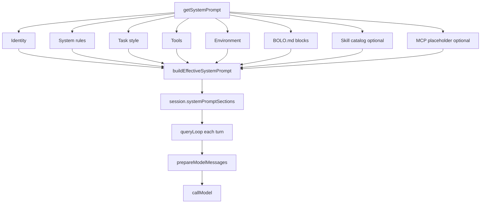

# 系统提示词与 BOLO.md

> 对照 HelsincyCode：`getSystemPrompt` / `buildEffectiveSystemPrompt` / `getUserContext`（CLAUDE.md）。  
> Bolo：**无遥测**、无 GrowthBook、无 `DYNAMIC_BOUNDARY` 全局缓存；文案精炼、品牌为 Bolo Code。

## 1. 模块入口

| 能力 | 位置 |
|------|------|
| 组装与 BOLO.md 加载 | `packages/core/src/systemPrompt.ts` |
| 会话字段 `systemPromptSections` | `packages/core` `createSession` / `createSessionFromWorkspace` |
| 每轮前缀 | `queryLoop` → `prepareModelMessages` → `callModel` |
| Provider 合并 `role: system` | `packages/providers`（OpenAI / Anthropic） |

对外导出（`@bolo/core` / 相对路径）：

- `loadBoloMd`
- `getSystemPrompt`
- `buildEffectiveSystemPrompt`
- `prepareModelMessages`
- `assembleSessionSystemPrompt`

## 2. 组装顺序

会话创建时调用 `assembleSessionSystemPrompt`（内部 `getSystemPrompt` → `buildEffectiveSystemPrompt`）。



**列表顺序（默认）：**

1. **Identity** — Bolo Code 编程助手  
2. **System** — 权限模式直觉、hooks、工具结果/标签、注入风险  
3. **Task style** — 简洁、用工具、可逆修改  
4. **Tools** — schema、Read 优先、Skill 目录仅索引  
5. **Environment** — cwd、date、platform、shell 提示、permissionMode、model（可知时）  
6. **BOLO.md** — 用户/项目指令（见 §3）  
7. **Skill catalog** — `formatSkillCatalog`（仅 id/描述，无全文）  
8. **MCP 占位** — 可选，默认不注入  

**`buildEffectiveSystemPrompt` 优先级：**

0. `overrideSystemPrompt` — 完全替换（无 append）  
1. `customSystemPrompt` — 替换默认段  
2. 否则使用 `defaultSystemPrompt` 各段  
3. 非 override 时末尾可 `appendSystemPrompt`（如 SessionStart hook 注入）

## 3. BOLO.md（对标 CLAUDE.md）

### 3.1 搜索路径与拼接顺序

按下列顺序**依次加载存在的文件**并拼进同一 system 块（全局 + 项目可同时存在；模型同时看到）：

| 顺序 | 逻辑路径 | 说明 |
|------|----------|------|
| 1 | `~/.bolo/BOLO.md`（或 `$BOLO_CONFIG_DIR/BOLO.md`） | 用户全局 |
| 2 | `{cwd}/BOLO.md` | 项目根（主品牌） |
| 3 | `{cwd}/.bolo/BOLO.md` | 项目配置目录 |
| 4 | `{cwd}/CLAUDE.md` | 兼容（可选） |
| 5 | `{cwd}/AGENTS.md` | 兼容（可选） |
| 6 | `{cwd}/.bolo/CLAUDE.md` | 兼容（可选） |

关闭加载：

- 环境变量 `BOLO_DISABLE_BOLO_MD=1`（或 `true` / `yes` / `on`）
- API：`loadInstructions: false` / `loadBoloMd({ disable: true })`

### 3.2 注入方式

- 作为 **独立 system section**（`# Project & user instructions (BOLO.md)`），**不是** user 消息。  
- 与 HC「userContext.claudeMd 再并入 API 前缀」同目标，实现上 Bolo 统一进 `systemPromptSections`。  
- **不**把本机绝对盘符写进文档；运行时 Environment 段会带真实 cwd（模型需要）。

### 3.3 预算 / 截断

| 常量 | 默认 |
|------|------|
| 单文件 `BOLO_MD_MAX_CHARS_PER_FILE` | 32_000 |
| 合计 `BOLO_MD_MAX_TOTAL_CHARS` | 48_000 |

超限文件末尾追加 truncated 标记；合计用尽后停止后续候选。

## 4. 与对话消息的关系

| 存储 | 内容 |
|------|------|
| `session.systemPromptSections` | 权威 system 段（会话级） |
| `session.messages` | user / assistant / tool（尽量不含 system） |

每轮：

```
prepareModelMessages({
  systemSections: session.systemPromptSections,
  conversation: messages without system,
})
→ [system…, user/assistant/tool…]
→ provider 合并 system
```

compact 只改对话消息；system 段仍由 `systemPromptSections` 前缀。  
compact 边界 `Conversation compacted`（role:system）保留在对话 API 视图中，不会被 `prepareModelMessages` 剥掉。

## 5. 与 HelsincyCode 的差距（有意后置）

| HC | Bolo v1 |
|----|---------|
| `SYSTEM_PROMPT_DYNAMIC_BOUNDARY` + 全局 cache scope | 不做 |
| GrowthBook / feature 门控长段 | 不做 |
| Coordinator / proactive / agent 替换 prompt | 不做 |
| 完整 memdir / auto-memory / rules 目录 walk | 仅 BOLO.md 候选文件 |
| git status 快照进 systemContext | 不做（可用工具查） |
| MCP instructions 动态段 | 可选占位 |
| 遥测 `logEvent` | **永不做** |
| 长文营销/品牌语气 | 精炼 Bolo 文案 |

## 6. 文案查阅表（非运行时）

个人查阅各 section 全文/动态变量：见 `docs/PROMPT_CATALOG.md`（与架构解耦，不以代码 import）。

## 7. 测试

```bash
node --import tsx/esm scripts/test-system-prompt.ts
# 或
npx tsx scripts/test-system-prompt.ts
```

回归：

```bash
npx tsx scripts/test-tool-calling.ts
npx tsx scripts/test-provider-unit.ts
npx tsx scripts/smoke-turn.ts
```

`smoke-turn` 默认 `systemPrompt: false` 保持最短 mock 路径；system 管线由 `test-system-prompt` 覆盖。